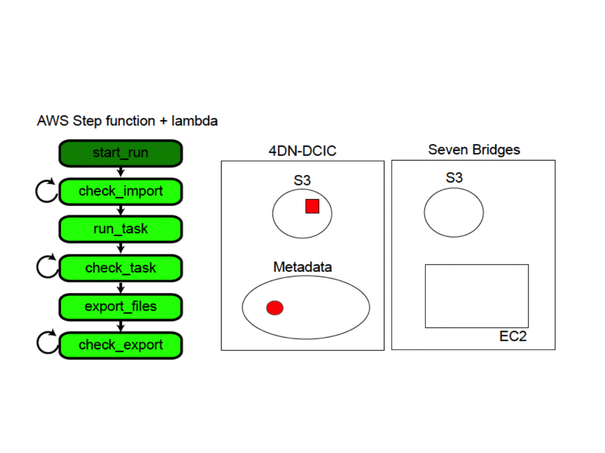
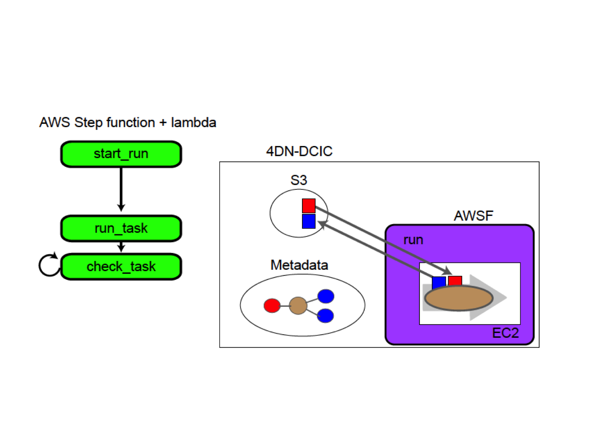

=====================
# Tibanna
=====================

Tibanna is the gas mine in Cloud City that makes Hyperdrives zoom.  It's also the pipeline running in the cloud that ensure data is properly processed for 4dn.

Tibanna is an AWS step-function-based pipeline scheduler. It connects to either SevenBridgesGenomics or to our own system.
  

  

  

## Directory Structure

## core
This is core functionality (a set of lambda functions) that relies on AWS STEP Function to manage the process of running pipelines.  Does stuff like stage files to correct place, run workflow, poll for results, put output files in s3 and update associated metadata on the fourfront system.

## awsf
A set of tools for running docker- and cwl-based pipelines on AWS
* [README](awsf/README.md) for more details

## lambda_sbg
A lambda function integrated with APIGateway, for managing pipelines on AWS and SBG
* [README](lambda_sbg/README.md) for more details

* TODO: have registration function that creates the step-function workflow, ideally storing
  configuration in internal tables so stats an be gathered and d presented to users. 
