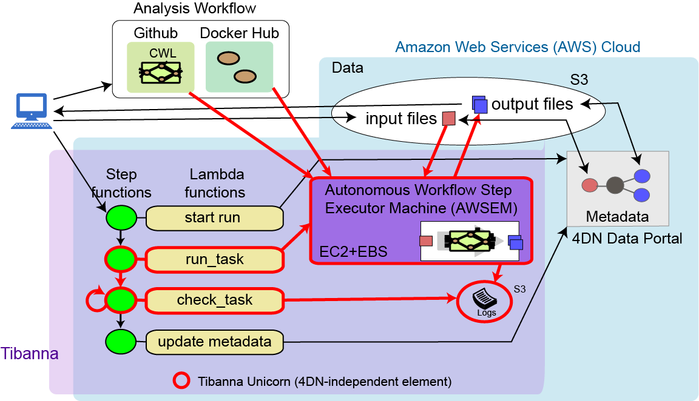

=====================
# Tibanna
=====================

Tibanna is a metadata-aware workflow engine that deploys and monitors CWL/Docker-based pipelines to the AWS cloud. Tibanna is a main workflow management system used by the 4DN DCIC (4D Nucleome Data Coordination and Integration Center). 

| [](https://travis-ci.org/4dn-dcic/tibanna) | [](https://www.codacy.com/app/4dn/tibanna?utm_source=github.com&amp;utm_medium=referral&amp;utm_content=4dn-dcic/tibanna&amp;utm_campaign=Badge_Grade) | [](https://www.codacy.com/app/4dn/tibanna?utm_source=github.com&amp;utm_medium=referral&amp;utm_content=4dn-dcic/tibanna&amp;utm_campaign=Badge_Coverage) |

***
 

Tibanna is auto-triggered upon data submission to execute a relevant workflow on the data. It utilizes two-layer scheduling; an upstream regulator based on a state machine called AWS Step Function and a downstream workflow engine that runs Docker/CWL-based pipelines. Tibanna’s AWS Step Function launches several AWS Serverless Lambda functions that control workflow-related metadata generation/tracking and deployment of a workflow on a pre-custom-configured autonomous virtual machine (EC2 instance) (AWSEM; Autonomous Workflow Step Executor Machine).

In addition, Tibanna offers multi-layer real-time monitoring to ensure the workflows are executed flawlessly. AWSEM sends real time logs from Docker/CWL to a designated S3 Bucket; individual AWS Lambda functions are checked through AWS CloudWatch; AWS Step function communicates with users at the top level. The system allows users to ssh into the EC2 instance where a workflow is currently being executed, to allow detailed investigation. Tibanna uses AWS IAM roles to ensure secure access. We have also implemented an accompanying resource optimizer for Tibanna (https://github.com/4dn-dcic/pipelines-cwl/tree/master/Benchmark), which calculates total CPU, memory and space required for a specific workflow run to determine EC2 instance type and EBS (Elastic Block Store) volume size. The calculation is based on input size, workflow parameters and the benchmarking results characteristic of individual workflows. The resource optimizer is essential for automated parameterization of data-dependent workflow runs, while maximizing the benefit of the elasticity of the cloud platform. Tibanna currently uses this optimizer to auto-determine instance types and EBS sizes for 4DN workflow runs.

Tibanna has been evolving: originally developed for Desktop workflow submitter that launches an autonomous VM, then upgraded to a Chalice/Lambda/API-Gateway-based system that works with the Seven Bridges Genomics (SBG) platform, and it currently consists of the original modules integrated with AWS Step functions for upstream scheduling and monitoring, without SBG.

## Commands
To run workflow
```
invoke run_workflow --input-json=<input_json_file> [--workflow=<stepfunctionname>]
# <stepfunctionname> may be one of tibanna_pony, tibanna_unicorn or tibanna_pony-dev
```
To deploy lambda functions
```
# individual lambda functions
invoke deploy_core <lambda_name>
# example <lambda_name> : run_task_awsem

# all lambda functions
invoke deploy_core all
```
To rerun a failed job with the same input json
```
invoke rerun --exec-arn=<stepfunctionrun_arn> [--workflow=<stepfunctionname>]
# <stepfunctionname> may be one of tibanna_pony, tibanna_unicorn or tibanna_pony-dev
```
To rerun many jobs that failed after a certain time point
```
invoke rerun_many [--workflow=<stepfunctionname>] \
                  [--stopdate=<stopdate>] \
                  [--stophour=<stophour>] \
                  [--stopminute=<stopminute>] \
                  [--sleeptime=<sleeptime>] \
                  [--offset=<offset>] \
                  [--status=<status>]
# <stepfunctionname> may be one of tibanna_pony (default), tibanna_unicorn or tibanna_pony-dev
# <stopdate> e.g. '14Feb2018'
# <stophour> e.g. 14 (24-hour format, EST by default, the time zone can be changed using --offset)
# <stopminute> e.g. 30 (default 0)
# <sleeptime> seconds between reruns (eefault 5)
# <offset> offset for hour (for a different time zone) (default 5, consistent with EST)
# <status> default 'FAILED', to collect and rerun only failed jobs

# example: invoke rerun_many --stopdate=14Feb2018 --stophour=15
```
To kill all currently running jobs (killing only step functions not the EC2 instances)
```
invoke kill_all [--workflow=<stepfunctionname>]
```


## Directory Structure

## core
This is core functionality (a set of lambda functions) that relies on AWS STEP Function to manage the process of running pipelines.  Does stuff like stage files to correct place, run workflow, poll for results, put output files in s3 and update associated metadata on the fourfront system.

## awsf
A set of tools for running docker- and cwl-based pipelines on AWS (AWSEM, Autonomous Workflow Step Executor Machine)
* [README](awsf/README.md) for more details - (this readme is currently outdated)

## lambda_sbg (deprecated)
A lambda function integrated with APIGateway, for managing pipelines on AWS and SBG
* [README](old/lambda_sbg/README.md) for more details


## How to use Tibanna without 4DN metadata
To use Tibanna independently of 4DN data portal, you can use the two-step system that consists of `run_task` and `check_task`. Instructions are provided below.
* [README](tutorials/tibanna_unicorn.md)
