===================================
Running 4DN pipelines using Tibanna
===================================

* For 4DN pipelines, benchmark functions are pre-implemented in Tibanna through the Benchmark package. This means that the user does not have to choose EC2 instance type or EBS size (they are auto-determined). However, if the user wants to specify them, the following fields can be used. ``EBS_optimized`` makes IO slightly faster, but it is not supported by all isntance types. If you're not sure, choose ``False``.

**Example**

::

      "config": {
        "instance_type": "instance_type",
        "ebs_size": 10,
        "EBS_optimized": False,

General Quality Control
+++++++++++++++++++++++

md5
---

* Description : calculates two md5sum values (one the file itself, one for ungzipped) for an input file. If the input file is not gzipped, it reports only the first one.
* CWL : https://github.com/4dn-dcic/pipelines-cwl/blob/dev/cwl_awsem_v1/md5.cwl
* Docker : ``duplexa/md5:v2``
* 4DN workflow metadata : https://data.4dnucleome.org/4dn-dcic-lab:wf-md5-0.2.6
* 4DN example run: https://data.4dnucleome.org/workflow-runs-awsem/75ce5f66-f98f-4222-9d1c-3daed262856b/#graph

|md5_4dn_run|

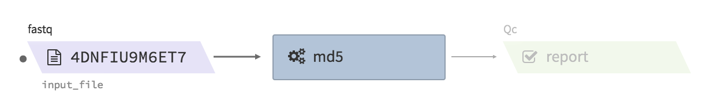

* Example input execution json template :

Use the following as a template and replace ``<YOUR....>`` with your input/output/log bucket/file(object) information.

::

    {
      "args": {
        "app_name": "md5",
        "app_version": "0.2.6",
        "cwl_directory_url": "https://raw.githubusercontent.com/4dn-dcic/pipelines-cwl/0.2.6/cwl_awsem/",
        "cwl_version": "v1",
        "cwl_main_filename": "md5.cwl",
        "input_files": {
          "input_file": {
            "bucket_name": "<YOUR_INPUT_BUCKET>",
            "object_key": "<YOUR_INPUT_FILE_NAME_IN_INPUT_BUCKET>"
          }
        },
        "output_S3_bucket": "<YOUR_OUTPUT_BUCKET>",
        "output_target": {
          "report": "<YOUR_OUTPUT_FILE_NAME_IN_OUTPUT_BUCKET>"
        }
      },
      "config": {
        "log_bucket": "<YOUR_LOG_BUCKET>",
        "key_name": "<YOUR_KEY_NAME>"
      }
    }

fastqc
------

* Description : run fastqc on a fastq file
* CWL : https://github.com/4dn-dcic/pipelines-cwl/blob/dev/cwl_awsem_v1/fastqc-0-11-4-1.cwl
* Docker : ``duplexa/4dn-hic:v32``
* 4DN workflow metadata : https://data.4dnucleome.org/4dn-dcic-lab:wf-fastqc-0.2.0
* 4DN example run: https://data.4dnucleome.org/workflow-runs-awsem/be8edc0a-f74a-4fae-858e-2915af283ee3/#details

|fastqc_4dn_run|

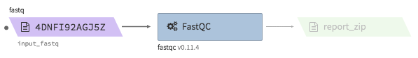

* Example input execution json template :

Use the following as a template and replace ``<YOUR....>`` with your input/output/log bucket/file(object) information.

::

    {
        "args" {
          "app_name": "fastqc-0-11-4-1",
          "app_version": "0.2.0",
          "cwl_version": "v1",
          "cwl_directory_url": "https://raw.githubusercontent.com/4dn-dcic/pipelines-cwl/0.2.6/cwl_awsem_v1/",
          "cwl_main_filename": "fastqc-0-11-4-1.cwl",
          "cwl_child_filenames": ["fastqc-0-11-4.cwl"],
          "input_files": {
              "input_fastq": {
                 "bucket_name": "<YOUR_INPUT_BUCKET>",
                 "object_key": "<YOUR_INPUT_FILE>"
              }
          },
          "output_S3_bucket": "<YOUR_OUTPUT_BUCKET>",
          "output_target": {
              "report_zip": "<YOUR_OUTPUT_REPORT_NAME>.zip"
          }
        },
        "config": {
          "log_bucket" : "<YOUR_LOG_BUCKET>",
          "key_name": "<YOUR_KEY_NAME>"
        }
    }

Hi-C data processing & QC
+++++++++++++++++++++++++

* Example full pipeline run

|hic_4dn_run|

.. |hic_4dn_run| image:: images/hic_4dn_run.png

bwa-mem
-------

* Description : aligns Hi-C fastq files to a reference genome using ``bwa mem -SP5M``. The output is a single bam file. The bam file is not resorted, and does not accompany a ``.bai`` index file. The bwa reference genome index must be bundled in a ``.tgz`` file.
* CWL : https://github.com/4dn-dcic/pipelines-cwl/blob/0.2.6/cwl_awsem_v1/bwa-mem.cwl
* Docker : ``duplexa/4dn-hic:v42.2``
* 4DN workflow metadata : https://data.4dnucleome.org/4dn-dcic-lab:wf-bwa-mem-0.2.6
* 4DN example run: https://data.4dnucleome.org/workflow-runs-awsem/14fd752d-ede1-4cc2-bb69-6fae5726e173/
* 4DN reference files: https://data.4dnucleome.org/search/?file_format.file_format=bwaIndex&file_type=genome+index&type=FileReference

|bwa_4dn_wf|

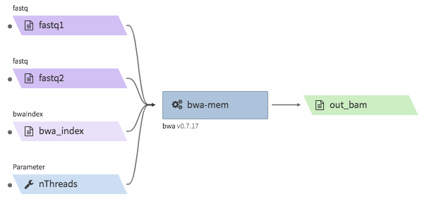

* Example input execution json template :

Use the following as a template and replace ``<YOUR....>`` with your input/output/log bucket/file(object) information.

::

    {
      "args": {
        "app_name": "bwa-mem",
        "app_version": "0.2.6",
        "cwl_directory_url": "https://raw.githubusercontent.com/4dn-dcic/pipelines-cwl/0.2.6/cwl_awsem_v1/",
        "cwl_main_filename": "bwa-mem.cwl",
        "cwl_version": "v1",
        "input_files": {
          "fastq1": {
            "bucket_name": "<YOUR_INPUT_BUCKET>",
            "object_key": "<YOUR_FASTQ_FILE_R1>"
          },
          "fastq2": {
            "bucket_name": "<YOUR_INPUT_BUCKET>",
            "object_key": "<YOUR_FASTQ_FILE_R2>"
          },
          "bwa_index": {
            "bucket_name": "<YOUR_INPUT_BUCKET>",
            "object_key": "<YOUR_TGZ_BWA_INDEX_FILE>"
          }
        },
        "input_parameters": {
            "nThreads": 2
        },
        "output_S3_bucket": "<YOUR_OUTPUT_BUCKET>",
        "output_target": {
          "out_bam": "<YOUR_OUTPUT_BAM_FILE>.bam"
        }
      },
      "config": {
        "log_bucket": "<YOUR_LOG_BUCKET>",
        "key_name": "<YOUR_KEY_NAME>"
      }
    }

hi-c-processing-bam
-------------------

* Description : takes in a set of bam files and performs merging, sorting, filtering and produces a ``.pairs.gz`` file (and a ``.pairs.gz.px2`` index file). The output includes a merged and filter-annotated lossless bam file.
* CWL : https://github.com/4dn-dcic/pipelines-cwl/blob/0.2.6/cwl_awsem_v1/hi-c-processing-bam..cwl
* Docker : ``duplexa/4dn-hic:v42.2``
* 4DN workflow metadata : https://data.4dnucleome.org/4dn-dcic-lab:wf-hi-c-processing-bam-0.2.6
* 4DN example run: https://data.4dnucleome.org/workflow-runs-awsem/b13b2ab8-f176-422f-a1eb-ed213ac991af/
* 4DN reference files:

  * chromsizes files : e.g.) https://data.4dnucleome.org/files-reference/4DNFI823LSII (GRCh38, main chromosomes only)
  * restriction site files : https://data.4dnucleome.org/search/?file_type=restriction+sites&type=FileReference

|hicbam_4dn_wf|

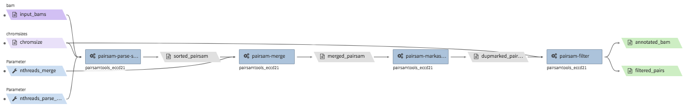

* Example input execution json template :

Use the following as a template and replace ``<YOUR....>`` with your input/output/log bucket/file(object) information.

::

    {
      "args": {
        "app_name": "hi-c-processing-bam",
        "app_version": "0.2.6",
        "cwl_directory_url": "https://raw.githubusercontent.com/4dn-dcic/pipelines-cwl/0.2.6/cwl_awsem_v1/",
        "cwl_main_filename": "hi-c-processing-bam.cwl",
        "cwl_child_filenames": [
          "pairsam-parse-sort.cwl",
          "pairsam-merge.cwl",
          "pairsam-markasdup.cwl",
          "pairsam-filter.cwl",
          "addfragtopairs.cwl"
        ],
        "input_files": {
          "chromsize": {
            "bucket_name": "<YOUR_INPUT_BUCKET>",
            "object_key": "<YOUR_INPUT_CHROMSIZES_FILE>"
          },
          "input_bams": {
            "bucket_name": "<YOUR_INPUT_BUCKET>",
            "object_key": [
              "<YOUR_BAM_FILE1>",
              "<YOUT_BAM_FILE2>",
              "<YOUT_BAM_FILE3>"
            ]
          },
          "restriction_file": {
             "bucket_name": "<YOUR_INPUT_BUCKET>",
             "object_key": "<YOUR_RESTRICTION_SITE_FILE>"
          }
        },
        "input_parameters": {
          "nthreads_parse_sort": 8,
          "nthreads_merge": 8
        },
        "output_S3_bucket": "<YOUR_OUTPUT_BUCKET>",
        "output_target": {
          "out_pairs": "<YOUR_OUTPUT_PAIRS_FILE>.pairs.gz",
          "merged_annotated_bam": "<YOUR_OUTPUT_MERGED_BAM_FILE>.bam"
        },
        "secondary_output_target": {
          "out_pairs": "<YOUR_OUTPUT_PAIRS_FILE>.pairs.gz.px2"
        }
      },
      "config": {
        "log_bucket": "<YOUR_LOG_BUCKET>",
        "key_name": "<YOUR_KEY_NAME>"
      }
    }

hi-c-processing-pairs
---------------------

* Description : takes in a set of pairs files, merges them and creates contact matrix files in both ``.mcool`` and ``.hic`` formats. The output includes a merged pairs file.
* CWL : https://github.com/4dn-dcic/pipelines-cwl/blob/0.2.6/cwl_awsem_v1/hi-c-processing-pairs.cwl
* Docker : ``duplexa/4dn-hic:v42.2``
* 4DN workflow metadata : https://data.4dnucleome.org/4dn-dcic-lab:wf-hi-c-processing-pairs-0.2.6
* 4DN example run: https://data.4dnucleome.org/workflow-runs-awsem/c0e0da16-a2f9-4e87-a3b2-8f6b4c675a52/

|hicpairs_4dn_wf|

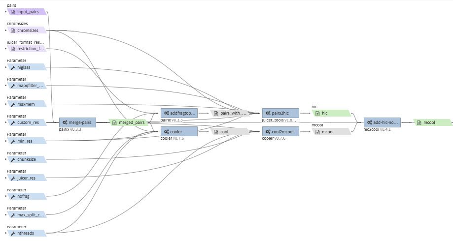

* Example input execution json template :

Use the following as a template and replace ``<YOUR....>`` with your input/output/log bucket/file(object) information.

::

    {
      "args": {
        "app_name": "hi-c-processing-pairs",
        "app_version": "0.2.6",
        "cwl_directory_url": "https://raw.githubusercontent.com/4dn-dcic/pipelines-cwl/0.2.6/cwl_awsem_v1/",
        "cwl_main_filename": "hi-c-processing-pairs.cwl",
        "cwl_child_filenames": [
          "merge-pairs.cwl",
          "addfragtopairs.cwl",
          "pairs2hic.cwl",
          "cooler.cwl",
          "cool2mcool.cwl",
          "extract-mcool-normvector-for-juicebox.cwl",
          "add-hic-normvector-to-mcool.cwl"
        ],
        "cwl_version": "v1",
        "input_files": {
          "chromsizes": {
            "bucket_name": "<YOUR_INPUT_BUCKET>",
            "object_key": "<YOUR_INPUT_CHROMSIZES_FILE>"
          },
          "input_pairs": {
            "bucket_name": "<YOUR_INPUT_BUCKET>",
            "object_key": [
                "<YOUR_INPUT_PAIRS_FILE1>",
                "<YOUR_INPUT_PAIRS_FILE2>",
                "<YOUR_INPUT_PAIRS_FILE3>"
            ]
          },
          "restriction_file": {
            "bucket_name": "<YOUR_INPUT_BUCKET>",
            "object_key": "<YOUR_RESTRICTION_SITE_FILE>"
          }
        },
        "input_parameters": {
          "ncores": 1,
          "maxmem": "8g"
        },
        "output_S3_bucket": "<YOUR_OUTPUT_BUCKET>",
        "output_target": {
          "mcool": "<YOUR_OUTPUT_MULTIRES_COOL_FILE>.mcool",
          "merged_pairs": "<YOUR_OUTPUT_MERGED_PAIRS_FILE>.pairs.gz",
          "hic": "<YOUR_OUTPUT_HIC_FILE>.hic"
        },
        "secondary_output_target": {
          "output_pairs": "<YOUR_OUTPUT_MERGED_PAIRS_FILE>.pairs.gz.px2"
        }
      },
      "config": {
        "log_bucket": "<YOUR_LOG_BUCKET>",
        "key_name": "<YOUR_KEY_NAME>"
      }
    }

pairsqc
-------

* Description : calculated QC stats for a pairs file and generates a report zip file containing an ``.html`` file and other table files.
* CWL : https://github.com/4dn-dcic/pipelines-cwl/blob/0.2.6/cwl_awsem_v1/pairsqc-single.cwl
* Docker : ``duplexa/4dn-hic:v42.2``
* 4DN workflow metadata : https://data.4dnucleome.org/4dn-dcic-lab:wf-pairsqc-single-0.2.6
* 4DN example run: https://data.4dnucleome.org/workflow-runs-awsem/902f34fa-dff9-4f26-9af5-64b39b13a069/

|pairsqc_4dn_wf|

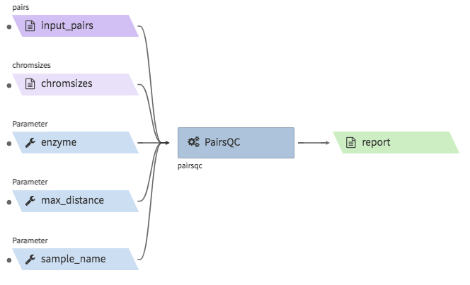

* Example input execution json template :

Use the following as a template and replace ``<YOUR....>`` with your input/output/log bucket/file(object) information.

::

    {
        "args": {
          "app_name": "pairsqc-single",
          "app_version": "0.2.6",
          "cwl_directory_url": "https://raw.githubusercontent.com/4dn-dcic/pipelines-cwl/dev/cwl_awsem_v1/",
          "cwl_main_filename": "pairsqc-single.cwl",
          "cwl_version": "v1",
          "input_files": {
            "input_pairs" : {
              "bucket_name": "<YOUR_INPUT_BUCKET>",
              "object_key": "<YOUR_PAIRS_FILE>"
            },
            "chromsizes" : {
              "bucket_name": "<YOUR_INPUT_BUCKET>",
              "object_key": "<YOUR_INPUT_CHROMSIZES_FILE>"
            }
          },
          "secondary_files": {
            "input_pairs": {
              "bucket_name": "<YOUR_INPUT_BUCKET>",
              "object_key": "<YOUR_PAIRS_FILE>.px2"
            }
          },
          "input_parameters" :  {
            "enzyme": "6",
            "sample_name": "4DNFI1ZLO9D7",
            "max_distance": 8.2
          },
          "output_S3_bucket": "<YOUR_OUTPUT_BUCKET>",
          "output_target": {
            "report": "<YOUR_OUTPUT_REPORT_FILE>.zip"
          }
        },
        "config": {
          "log_bucket": "<YOUR_LOG_BUCKET>",
          "key_name": "<YOUR_KEY_NAME>"
        }
    }

Repli-seq data processing & QC
++++++++++++++++++++++++++++++

repliseq-parta
--------------

* Description : takes in repli-seq single-end fastq file and performs alignment, sorting, filtering and produces a bedgraph file containing read counts per bin.
* CWL : https://raw.githubusercontent.com/4dn-dcic/docker-4dn-repliseq/v14/cwl/repliseq-parta.cwl
* Docker : ``duplexa/4dn-repliseq:v14``
* 4DN workflow metadata : https://data.4dnucleome.org/4dn-dcic-lab:wf-repliseq-parta-v14
* 4DN example run: https://data.4dnucleome.org/workflow-runs-awsem/66e76f78-0495-4a2a-abfc-2d494d724ded/

|repliseq_a_4dn_wf|

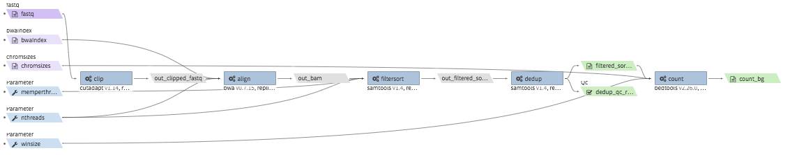

* Example input execution json template :

Use the following as a template and replace ``<YOUR....>`` with your input/output/log bucket/file(object) information.

::

    {
      "args": {
        "app_name": "repliseq-parta",
        "app_version": "v14",
        "cwl_directory_url": "https://raw.githubusercontent.com/4dn-dcic/docker-4dn-repliseq/v14/cwl/"
        "cwl_main_filename": "repliseq-parta.cwl",
        "cwl_child_filenames": ["clip.cwl","align.cwl","filtersort.cwl","dedup.cwl","count.cwl"],
        "cwl_version": "v1",
        "input_files": {
          "fastq": {
            "bucket_name": "<YOUR_INPUT_BUCKET>",
            "object_key": "<YOUR_INPUT_FASTQ>"
          },
          "bwaIndex": {
            "bucket_name": "<YOUR_INPUT_BUCKET>",
            "object_key": "<YOUR_INPUT_TGZ_BWA_INDEX>"
          },
          "chromsizes": {
            "bucket_name": "<YOUR_INPUT_BUCKET>",
            "object_key": "<YOUR_CHROMSIZES_FILE>"
          }
        },
        "input_parameters": { "nthreads": 8 },
        "output_S3_bucket": "<YOUR_OUTPUT_BUCKET>",
        "output_target": {
           "filtered_sorted_deduped_bam": "<YOUR_OUTPUT_FILTERED_BAM>.bam",
           "dedup_qc_report": "<YOUR_QC_REPORT>.zip",
           "count_bg": "<YOUR_OUTPUT_COUNT_BEDGRAPH_FILE>.bg"
        }
      },
      "config": {
        "log_bucket": "<YOUR_LOG_BUCKET>",
        "key_name": "<YOUR_KEY_NAME>"
      }
    }

ChIP-seq data processing & QC
+++++++++++++++++++++++++++++

* Example full pipeline run

|chipseq_4dn_run|

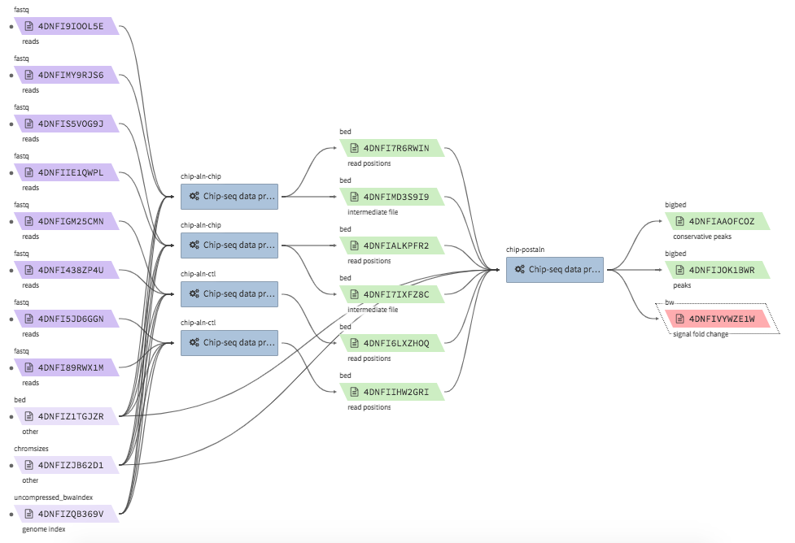

encode-chipseq-aln-chip
-----------------------

* Description : takes in fastq files from a single biological replicate (may consist of multiple technical replicates) and generates a TagAlign file for that biological replicate. The output includes another TagAlign file exclusively for xcor analysis in the next step (``encode-chipseq-postaln``).
* WDL : https://raw.githubusercontent.com/4dn-dcic/chip-seq-pipeline2/master/chip.wdl
* Docker : ``4dndcic/encode-chipseq:v1.1.1``
* 4DN workflow metadata : https://data.4dnucleome.org/4dn-dcic-lab:wf-encode-chipseq-aln-chip
* 4DN example run: https://data.4dnucleome.org/workflow-runs-awsem/3e0fc011-5e84-476e-93a7-176d4ce718c6/

|chipseq_aln_chip_4dn_wf|

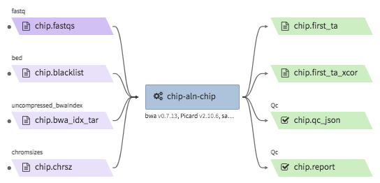

* Example input execution json template :

Use the following as a template and replace ``<YOUR....>`` with your input/output/log bucket/file(object) information.

::

    {
      "args": {
        "app_name": "encode-chipseq-aln-chip",
        "app_version": "v1.1.1",
        "wdl_directory_url": "https://raw.githubusercontent.com/4dn-dcic/chip-seq-pipeline2/master/chip.wdl",
        "wdl_main_filename": "chip.wdl",
        "language": "wdl",
        "input_files": {
          "chip.fastqs": {
            "bucket_name": "<YOUR_INPUT_BUCKET>",
            "object_key": [[
                ["<YOUR_INPUT_FASTQ_R1_TECHREP1>.fastq.gz", "<YOUR_INPUT_FASTQ_R2_TECHREP1>.fastq.gz"],
                ["<YOUR_INPUT_FASTQ_R1_TECHREP2>.fastq.gz", "<YOUR_INPUT_FASTQ_R2_TECHREP2>.fastq.gz"]
            ]]
          },
          "chip.bwa_idx_tar": {
            "bucket_name": "<YOUR_INPUT_BUCKET>",
            "rename": "GRCh38_no_alt_analysis_set_GCA_000001405.15.fasta.tar",
            "object_key": "<YOUR_INPUT_TAR_BWA_INDEX>"
          },
          "chip.blacklist": {
            "bucket_name": "<YOUR_INPUT_BUCKET>",
            "object_key": "<YOUR_BLACKLIST_FILE>.bed.gz"
          },
          "chip.chrsz": {
            "bucket_name": "<YOUR_INPUT_BUCKET>",
            "object_key": "<YOUR_CHROMSIZES_FILE>.chrom.sizes"
          }
        },
        "input_parameters": { 
            "chip.pipeline_type" : "histone",
            "chip.paired_end" : true,
            "chip.choose_ctl.always_use_pooled_ctl" : true,
            "chip.qc_report.name" : "<YOUR_QC_REPORT_NAME>",
            "chip.qc_report.desc" : "<YOUR_QC_REPORT_DESCRIPTION>",
            "chip.gensz" : "hs",
            "chip.bam2ta.regex_grep_v_ta" : "chr[MUE]|random|alt",
            "chip.fraglen": [],
            "chip.bwa.cpu": 16,
            "chip.merge_fastq.cpu": 16,
            "chip.filter.cpu": 16,
            "chip.bam2ta.cpu": 16,
            "chip.xcor.cpu": 16,
            "chip.align_only": true
        },
        "output_S3_bucket": "<YOUR_INPUT_BUCKET>",
        "output_target": {
           "chip.first_ta": "<YOUR_OUTPUT_TAG_ALIGN_FILE>.bed.gz",
           "chip.first_ta_xcor": "<YOUR_OUTPUT_TAG_ALIGN_FILE_FOR_XCOR>.bed.gz"
        }
      },
      "config": { 
        "log_bucket": "<YOUR_LOG_BUCKET>",
        "key_name": "<YOUR_KEY_NAME>"
      }
    }

encode-chipseq-aln-ctl
----------------------

* Description : takes in control fastq files from a single biological replicate (may consist of multiple technical replicates) and generates a TagAlign file for that biological replicate.
* WDL : https://raw.githubusercontent.com/4dn-dcic/chip-seq-pipeline2/master/chip.wdl
* Docker : ``4dndcic/encode-chipseq:v1.1.1``
* 4DN workflow metadata : https://data.4dnucleome.org/4dn-dcic-lab:wf-encode-chipseq-aln-ctl
* 4DN example run: https://data.4dnucleome.org/workflow-runs-awsem/f02336f6-aa6e-491d-8562-db61bcc86303/

|chipseq_aln_ctl_4dn_wf|

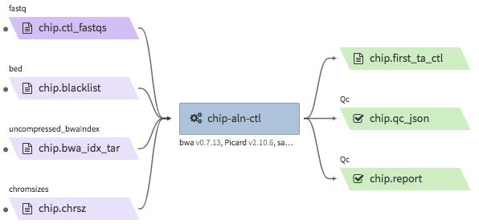

* Example input execution json template :

Use the following as a template and replace ``<YOUR....>`` with your input/output/log bucket/file(object) information.

::

    {
      "args": {
        "app_name": "encode-chipseq-aln-ctl",
        "app_version": "v1.1.1",
        "wdl_directory_url": "https://raw.githubusercontent.com/4dn-dcic/chip-seq-pipeline2/master/chip.wdl",
        "wdl_main_filename": "chip.wdl",
        "language": "wdl",
        "input_files": {
          "chip.ctl_fastqs": {
            "bucket_name": "<YOUR_INPUT_BUCKET>",
            "object_key": [[
                ["<YOUR_INPUT_FASTQ_R1_TECHREP1>.fastq.gz", "<YOUR_INPUT_FASTQ_R2_TECHREP1>.fastq.gz"],
                ["<YOUR_INPUT_FASTQ_R1_TECHREP2>.fastq.gz", "<YOUR_INPUT_FASTQ_R2_TECHREP2>.fastq.gz"]
            ]]
          },
          "chip.bwa_idx_tar": {
            "bucket_name": "<YOUR_INPUT_BUCKET>",
            "rename": "GRCh38_no_alt_analysis_set_GCA_000001405.15.fasta.tar",
            "object_key": "<YOUR_INPUT_TAR_BWA_INDEX>"
          },
          "chip.blacklist": {
            "bucket_name": "<YOUR_INPUT_BUCKET>",
            "object_key": "<YOUR_BLACKLIST_FILE>.bed.gz"
          },
          "chip.chrsz": {
            "bucket_name": "<YOUR_INPUT_BUCKET>",
            "object_key": "<YOUR_CHROMSIZES_FILE>.chrom.sizes"
          }
        },
        "input_parameters": { 
            "chip.pipeline_type" : "histone",
            "chip.paired_end" : true,
            "chip.choose_ctl.always_use_pooled_ctl" : true,
            "chip.qc_report.name" : "<YOUR_QC_REPORT_NAME>",
            "chip.qc_report.desc" : "<YOUR_QC_REPORT_DESCRIPTION>",
            "chip.gensz" : "hs",
            "chip.bam2ta_ctl.regex_grep_v_ta" : "chr[MUE]|random|alt",
            "chip.fraglen": [],
            "chip.bwa_ctl.cpu": 16,
            "chip.merge_fastq_ctl.cpu": 16,
            "chip.filter_ctl.cpu": 16,
            "chip.bam2ta_ctl.cpu": 16,
            "chip.align_only": true
        },
        "output_S3_bucket": "<YOUR_INPUT_BUCKET>",
        "output_target": {
           "chip.first_ta": "<YOUR_OUTPUT_TAG_ALIGN_FILE>.bed.gz",
           "chip.first_ta_xcor": "<YOUR_OUTPUT_TAG_ALIGN_FILE_FOR_XCOR>.bed.gz"
        }
      },
      "config": { 
        "log_bucket": "<YOUR_LOG_BUCKET>",
        "key_name": "<YOUR_KEY_NAME>"
      }
    }

encode-chipseq-postaln
----------------------

* Description : takes in TagAlign files generates from ``encode-chipseq-aln-chip`` and ``encode-chipsq-aln-ctl`` and calls peaks. The output files are signal fold change (bigwig) and two peak call sets (bigbed). The pipeline cannot handle more than two biological replicates due to the limitation of the ENCODE pipeline.
* WDL : https://raw.githubusercontent.com/4dn-dcic/chip-seq-pipeline2/master/chip.wdl
* Docker : ``4dndcic/encode-chipseq:v1.1.1``
* 4DN workflow metadata : https://data.4dnucleome.org/4dn-dcic-lab:wf-encode-chipseq-postaln
* 4DN example run: https://data.4dnucleome.org/workflow-runs-awsem/8666c89e-eccb-4dc1-9b12-ceb04802ca09/

|chipseq_postaln_4dn_wf|

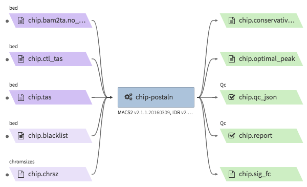

* Example input execution json template :

Use the following as a template and replace ``<YOUR....>`` with your input/output/log bucket/file(object) information.

::

    {
        "args": {
          "app_name": "encode-chipseq-postaln",
          "app_version": "v1.1.1",
          "wdl_directory_url": "https://raw.githubusercontent.com/4dn-dcic/chip-seq-pipeline2/master/chip.wdl",
          "wdl_main_filename": "chip.wdl",
          "language": "wdl",
          "input_files" : {
             "chip.tas" : { 
               "bucket_name": "<YOUR_INPUT_BUCKET>",
               "object_key": ["<YOUR_INPUT_TAG_ALIGN_BIOREP1>.bed.gz",
                              "<YOUR_INPUT_TAG_ALIGN_BIOREP2>.bed.gz"],
               "rename": ["<YOUR_INPUT_TAG_ALIGN_BIOREP1>.tagAlign.gz",
                          "<YOUR_INPUT_TAG_ALIGN_BIOREP2>.tagAlign.gz"]
             },
             "chip.ctl_tas" : { 
               "bucket_name": "<YOUR_INPUT_BUCKET>",
               "object_key": ["<YOUR_INPUT_CTL_TAG_ALIGN_BIOREP1>.bed.gz",
                              "<YOUR_INPUT_CTL_TAG_ALIGN_BIOREP2>.bed.gz"],
               "rename": ["<YOUR_INPUT_CTL_TAG_ALIGN_BIOREP1>.tagAlign.gz",
                          "<YOUR_INPUT_CTL_TAG_ALIGN_BIOREP2>.tagAlign.gz"]
             },
             "chip.bam2ta_no_filt_R1.ta" : { 
               "bucket_name": "<YOUR_INPUT_BUCKET>",
               "object_key": ["<YOUR_INPUT_XCOR_TAG_ALIGN_BIOREP1>.bed.gz",
                              "<YOUR_INPUT_XCOR_TAG_ALIGN_BIOREP1>.bed.gz"],
               "rename": ["<YOUR_INPUT_XCOR_TAG_ALIGN_BIOREP1>.tagAlign.gz",
                          "<YOUR_INPUT_XCOR_TAG_ALIGN_BIOREP2>.tagAlign.gz"]
             },
             "chip.blacklist" : { 
               "bucket_name": "<YOUR_INPUT_BUCKET>",
               "object_key": "<YOUR_BLACKLIST_FILE>.bed.gz"
             },
             "chip.chrsz" : { 
               "bucket_name": "<YOUR_INPUT_BUCKET>",
               "object_key": "<YOUR_CHROMSIZES_FILE>"
             }
          },
          "input_parameters": { 
            "chip.pipeline_type" : "histone",
            "chip.paired_end" : true,
            "chip.choose_ctl.always_use_pooled_ctl" : true,
            "chip.qc_report.name" : "<YOUR_QC_REPORT_NAME>",
            "chip.qc_report.desc" : "<YOUR_QC_REPORT_DESCRIPTION>",
            "chip.gensz" : "hs",
            "chip.xcor.cpu": 4,
            "chip.spp_cpu": 4
          },
          "output_S3_bucket": "<YOUR_OUTPUT_BUCKET>",
          "output_target": {
            "chip.sig_fc": "<YOUR_OUTPUT_SIGNAL_FC_FILE>.bw",
            "chip.optimal_peak": "<YOUR_OUTPUT_OPTIMAL_PEAK_FILE>.bb",
            "chip.conservative_peak": "<YOUR_OUTPUT_CONSERVATIVE_PEAK_FILE>.bb",
            "chip.report": "<YOUR_OUTPUT_QC_REPORT>.html",
            "chip.qc_json": "<YOUR_OUTPUT_QC_JSON>.json"
          }
      },
      "config": { 
        "log_bucket": "<YOUR_LOG_BUCKET>",
        "key_name": "<YOUR_KEY_NAME>"
      }
    }

ATAC-seq data processing & QC
+++++++++++++++++++++++++++++

* Example full pipeline run

|atacseq_4dn_run|

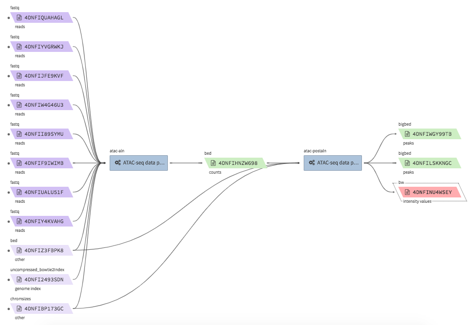

encode-atacseq-aln
------------------

* Description : takes in fastq files from a single biological replicate (may consist of multiple technical replicates) and generates a TagAlign file for that biological replicate.
* WDL : https://raw.githubusercontent.com/4dn-dcic/atac-seq-pipeline/master/atac.wdl
* Docker : ``4dndcic/encode-atacseq:v1.1.1``
* 4DN workflow metadata : https://data.4dnucleome.org/4dn-dcic-lab:wf-encode-atacseq-aln
* 4DN example run: https://data.4dnucleome.org/workflow-runs-awsem/c57697c4-c589-4025-ad81-e212a5220f74/

|atacseq_aln_4dn_wf|

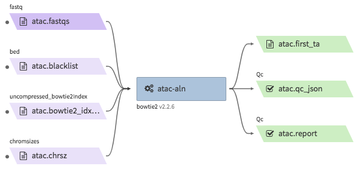

* Example input execution json template :

Use the following as a template and replace ``<YOUR....>`` with your input/output/log bucket/file(object) information.

::

    {
      "args": {
        "app_name": "encode-atacseq-aln",
        "app_version": "1.1.1",
        "wdl_directory_url": "https://raw.githubusercontent.com/4dn-dcic/atac-seq-pipeline/master/",
        "wdl_main_filename": "atac.wdl",
        "language": "wdl",
        "input_files": {
          "atac.bowtie2_idx_tar": {
            "rename": "mm10_no_alt_analysis_set_ENCODE.fasta.tar",
            "bucket_name": "<YOUR_INPUT_BUCKET>",
            "object_key": "<YOUR_TAR_BOWTIE2_INDEX>"
          },
          "atac.fastqs": {
            "bucket_name": "<YOUR_INPUT_BUCKET>",
            "object_key": [[
                ["<YOUR_INPUT_FASTQ_R1_TECHREP1>.fastq.gz", "<YOUR_INPUT_FASTQ_R2_TECHREP1>.fastq.gz"],
                ["<YOUR_INPUT_FASTQ_R1_TECHREP2>.fastq.gz", "<YOUR_INPUT_FASTQ_R2_TECHREP2>.fastq.gz"]
            ]]
          },
          "atac.blacklist": {
            "bucket_name": "<YOUR_INPUT_BUCKET>",
            "object_key": "<YOUR_BLACKLIST_FILE>.bed.gz"
          },
          "atac.chrsz": {
            "bucket_name": "<YOUR_INPUT_BUCKET>",
            "object_key": "<YOUR_CHROMSIZES_FILE>"
          }
        },
        "input_parameters": {
          "atac.trim_adapter.cpu": 4,
          "atac.paired_end": true,
          "atac.bam2ta.regex_grep_v_ta": "chr[MUE]|random|alt",
          "atac.enable_xcor": false,
          "atac.disable_ataqc": true,
          "atac.filter.cpu": 4,
          "atac.trim_adapter.auto_detect_adapter": true,
          "atac.bam2ta.cpu": 4,
          "atac.bowtie2.cpu": 4,
          "atac.gensz": "mm",
          "atac.pipeline_type": "atac",
          "atac.align_only": true
        },
        "output_S3_bucket": "<YOUR_OUTPUT_BUCKET>",
        "output_target": {
          "atac.first_ta": "<YOUR_OUTPUT_TAGALIGN>.bed.gz",
          "atac.report": "<YOUR_OUTPUT_QC_REPORT>.html",
          "atac.qc_json": "<YOUR_OUTPUT_QC_JSON.json",
        }
      },
      "config": {
        "log_bucket": "<YOUR_LOG_BUCKET>",
        "key_name": "<YOUR_KEY_NAME>"
      }
    }

encode-atacseq-postaln
----------------------

* Description : takes in TagAlign files generates from ``encode-atacseq-aln`` and calls peaks. The output files are signal fold change (bigwig) and two peak call sets (bigbed). The pipeline cannot handle more than two biological replicates due to the limitation of the ENCODE pipeline.
* WDL : https://raw.githubusercontent.com/4dn-dcic/atac-seq-pipeline/master/atac.wdl
* Docker : ``4dndcic/encode-atacseq:v1.1.1``
* 4DN workflow metadata : https://data.4dnucleome.org/4dn-dcic-lab:wf-encode-atacseq-postaln
* 4DN example run: https://data.4dnucleome.org/workflow-runs-awsem/afe50cb7-7417-4870-a5be-060600738fb0/

|atacseq_postaln_4dn_wf|

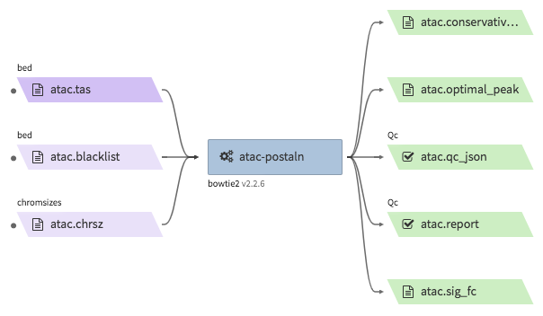

* Example input execution json template :

Use the following as a template and replace ``<YOUR....>`` with your input/output/log bucket/file(object) information.

::

    {
        "args": {
          "app_name": "encode-atacseq-postaln",
          "app_version": "v1.1.1",
          "wdl_directory_url": "https://raw.githubusercontent.com/4dn-dcic/atac-seq-pipeline/master/atac.wdl",
          "wdl_main_filename": "atac.wdl",
          "language": "wdl",
          "input_files" : {
             "atac.tas" : { 
               "bucket_name": "<YOUR_INPUT_BUCKET>",
               "object_key": ["<YOUR_INPUT_TAG_ALIGN_BIOREP1>.bed.gz",
                              "<YOUR_INPUT_TAG_ALIGN_BIOREP2>.bed.gz"],
               "rename": ["<YOUR_INPUT_TAG_ALIGN_BIOREP1>.tagAlign.gz",
                          "<YOUR_INPUT_TAG_ALIGN_BIOREP2>.tagAlign.gz"]
             },
             "atac.blacklist" : { 
               "bucket_name": "<YOUR_INPUT_BUCKET>",
               "object_key": "<YOUR_BLACKLIST_FILE>.bed.gz"
             },
             "atac.chrsz" : { 
               "bucket_name": "<YOUR_INPUT_BUCKET>",
               "object_key": "<YOUR_CHROMSIZES_FILE>"
             }
          },
          "input_parameters": { 
            "atac.pipeline_type" : "atac",
            "atac.paired_end" : true,
            "atac.gensz" : "hs",
            "atac.disable_ataqc": true,
            "atac.enable_xcor": false
          },
          "output_S3_bucket": "<YOUR_OUTPUT_BUCKET>",
          "output_target": {
            "atac.sig_fc": "<YOUR_OUTPUT_SIGNAL_FC_FILE>.bw",
            "atac.optimal_peak": "<YOUR_OUTPUT_OPTIMAL_PEAK_FILE>.bb",
            "atac.conservative_peak": "<YOUR_OUTPUT_CONSERVATIVE_PEAK_FILE>.bb",
            "atac.report": "<YOUR_OUTPUT_QC_REPORT>.html",
            "atac.qc_json": "<YOUR_OUTPUT_QC_JSON>.json"
          }
      },
      "config": { 
        "log_bucket": "<YOUR_LOG_BUCKET>",
        "key_name": "<YOUR_KEY_NAME>"
      }
    }
