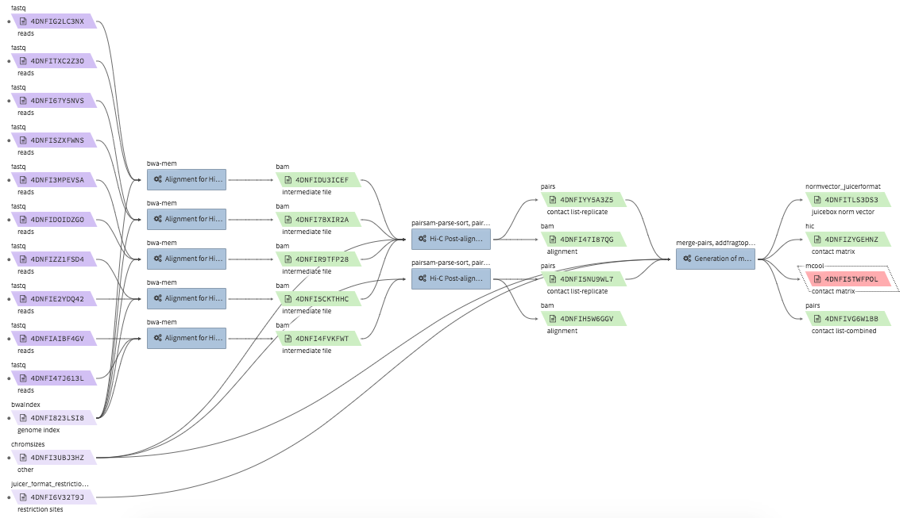

===================================
Running 4DN pipelines using Tibanna
===================================

* For 4DN pipelines, benchmark functions are pre-implemented in Tibanna through the Benchmark package. This means that the user does not have to choose EC2 instance type or EBS size (they are auto-determined). Use the following blank values for these config fields. The user may choose specific instance type or EBS size if needed.

::

      "config": {
        "instance_type": "",
        "ebs_size": 0,
        "EBS_optimized": "",

General Quality Control
+++++++++++++++++++++++

md5
---

* Description : calculates two md5sum values (one the file itself, one for ungzipped) for an input file. If the input file is not gzipped, it reports only the first one.
* CWL : https://github.com/4dn-dcic/pipelines-cwl/blob/dev/cwl_awsem_v1/md5.cwl
* Docker : ``duplexa/md5:v2``
* 4DN workflow metadata : https://data.4dnucleome.org/4dn-dcic-lab:wf-md5-0.2.6
* 4DN example run: https://data.4dnucleome.org/workflow-runs-awsem/75ce5f66-f98f-4222-9d1c-3daed262856b/#graph

|md5_4dn_run|

* Example input execution json template :

Use the following as a template and replace ``<YOUR....>`` with your input/output/log bucket/file(object) information.

::

    {
      "args": {
        "app_name": "md5",
        "app_version": "0.2.6",
        "cwl_directory_url": "https://raw.githubusercontent.com/4dn-dcic/pipelines-cwl/0.2.6/cwl_awsem/",
        "cwl_version": "v1",
        "cwl_main_filename": "md5.cwl",
        "input_files": {
          "input_file": {
            "bucket_name": "<YOUR_INPUT_BUCKET>",
            "object_key": "<YOUR_INPUT_FILE_NAME_IN_INPUT_BUCKET>"
          }
        },
        "output_S3_bucket": "<YOUR_OUTPUT_BUCKET>",
        "output_target": {
          "report": "<YOUR_OUTPUT_FILE_NAME_IN_OUTPUT_BUCKET>"
        }
      },
      "config": {
        "log_bucket": "<YOUR_LOG_BUCKET>",
        "key_name": "<YOUR_KEY_NAME>"
      }
    }

fastqc
------

* Description : run fastqc on a fastq file
* CWL : https://github.com/4dn-dcic/pipelines-cwl/blob/dev/cwl_awsem_v1/fastqc-0-11-4-1.cwl
* Docker : ``duplexa/4dn-hic:v32``
* 4DN workflow metadata : https://data.4dnucleome.org/4dn-dcic-lab:wf-fastqc-0.2.0
* 4DN example run: https://data.4dnucleome.org/workflow-runs-awsem/be8edc0a-f74a-4fae-858e-2915af283ee3/#details

|fastqc_4dn_run|

* Example input execution json template :

Use the following as a template and replace ``<YOUR....>`` with your input/output/log bucket/file(object) information.

::

    {
        "args" {
          "app_name": "fastqc-0-11-4-1",
          "app_version": "0.2.0",
          "cwl_version": "v1",
          "cwl_directory_url": "https://raw.githubusercontent.com/4dn-dcic/pipelines-cwl/0.2.6/cwl_awsem_v1/",
          "cwl_main_filename": "fastqc-0-11-4-1.cwl",
          "cwl_child_filenames": ["fastqc-0-11-4.cwl"],
          "input_files": {
              "input_fastq": {
                 "bucket_name": "<YOUR_INPUT_BUCKET>",
                 "object_key": "<YOUR_INPUT_FILE>"
              }
          },
          "output_S3_bucket": "<YOUR_OUTPUT_BUCKET>",
          "output_target": {
              "report_zip": "<YOUR_OUTPUT_REPORT_NAME>.zip"
          }
        },
        "config": {
          "log_bucket" : "<YOUR_LOG_BUCKET>",
          "key_name": "<YOUR_KEY_NAME>"
        }
    }

Hi-C data processing & QC
+++++++++++++++++++++++++

* Example full pipeline run

|hic_4dn_run|

bwa-mem
-------

* Description : calculates two md5sum values (one the file itself, one for ungzipped) for an input file. If the input file is not gzipped, it reports only the first one.
* CWL : https://github.com/4dn-dcic/pipelines-cwl/blob/0.2.6/cwl_awsem_v1/bwa-mem.cwl
* Docker : ``duplexa/4dn-hic:v42.2``
* 4DN workflow metadata : https://data.4dnucleome.org/4dn-dcic-lab:wf-bwa-mem-0.2.6
* 4DN example run: https://data.4dnucleome.org/workflow-runs-awsem/14fd752d-ede1-4cc2-bb69-6fae5726e173/

|bwa_4dn_wf|

* Example input execution json template :

Use the following as a template and replace ``<YOUR....>`` with your input/output/log bucket/file(object) information.

::

hi-c-processing-bam
-------------------

* Description : calculates two md5sum values (one the file itself, one for ungzipped) for an input file. If the input file is not gzipped, it reports only the first one.
* CWL : https://github.com/4dn-dcic/pipelines-cwl/blob/0.2.6/cwl_awsem_v1/hi-c-processing-bam..cwl
* Docker : ``duplexa/4dn-hic:v42.2``
* 4DN workflow metadata : https://data.4dnucleome.org/4dn-dcic-lab:wf-hi-c-processing-bam-0.2.6
* 4DN example run: https://data.4dnucleome.org/workflow-runs-awsem/b13b2ab8-f176-422f-a1eb-ed213ac991af/

|hicbam_4dn_wf|

.. |hicbam_4dn_wf| image:: images/hicbam_4dn_wf.png

* Example input execution json template :

Use the following as a template and replace ``<YOUR....>`` with your input/output/log bucket/file(object) information.

::

hi-c-processing-pairs
---------------------

* Description : calculates two md5sum values (one the file itself, one for ungzipped) for an input file. If the input file is not gzipped, it reports only the first one.
* CWL : https://github.com/4dn-dcic/pipelines-cwl/blob/0.2.6/cwl_awsem_v1/hi-c-processing-pairs.cwl
* Docker : ``duplexa/4dn-hic:v42.2``
* 4DN workflow metadata : https://data.4dnucleome.org/4dn-dcic-lab:wf-hi-c-processing-pairs-0.2.6
* 4DN example run: https://data.4dnucleome.org/workflow-runs-awsem/c0e0da16-a2f9-4e87-a3b2-8f6b4c675a52/

|hicpairs_4dn_wf|

.. |hicpairs_4dn_wf| image:: images/hicpairs_4dn_wf.png

* Example input execution json template :

Use the following as a template and replace ``<YOUR....>`` with your input/output/log bucket/file(object) information.

::

pairsqc
-------

* Description : calculates two md5sum values (one the file itself, one for ungzipped) for an input file. If the input file is not gzipped, it reports only the first one.
* CWL : https://github.com/4dn-dcic/pipelines-cwl/blob/0.2.6/cwl_awsem_v1/pairsqc-single.cwl
* Docker : ``duplexa/4dn-hic:v42.2``
* 4DN workflow metadata : https://data.4dnucleome.org/4dn-dcic-lab:wf-pairsqc-single-0.2.6
* 4DN example run: https://data.4dnucleome.org/workflow-runs-awsem/902f34fa-dff9-4f26-9af5-64b39b13a069/

|pairsqc_4dn_wf|

.. |pairsqc_4dn_wf| image:: images/pairsqc_4dn_wf.png

* Example input execution json template :

Use the following as a template and replace ``<YOUR....>`` with your input/output/log bucket/file(object) information.

::

Repli-seq data processing & QC
++++++++++++++++++++++++++++++

repliseq-parta
--------------

* Description : calculates two md5sum values (one the file itself, one for ungzipped) for an input file. If the input file is not gzipped, it reports only the first one.
* CWL : https://raw.githubusercontent.com/4dn-dcic/docker-4dn-repliseq/v14/cwl/repliseq-parta.cwl
* Docker : ``duplexa/4dn-repliseq:v14``
* 4DN workflow metadata : https://data.4dnucleome.org/4dn-dcic-lab:wf-repliseq-parta-v14
* 4DN example run: https://data.4dnucleome.org/workflow-runs-awsem/66e76f78-0495-4a2a-abfc-2d494d724ded/

|repliseq_a_4dn_wf|

* Example input execution json template :

Use the following as a template and replace ``<YOUR....>`` with your input/output/log bucket/file(object) information.

::

ChIP-seq data processing & QC
+++++++++++++++++++++++++++++

* Example full pipeline run

|chipseq_4dn_run|

encode-chipseq-aln-chip
-----------------------

* Description : calculates two md5sum values (one the file itself, one for ungzipped) for an input file. If the input file is not gzipped, it reports only the first one.
* WDL : https://raw.githubusercontent.com/4dn-dcic/chip-seq-pipeline2/master/chip.wdl
* Docker : ``4dndcic/encode-chipseq:v1.1.1``
* 4DN workflow metadata : https://data.4dnucleome.org/4dn-dcic-lab:wf-encode-chipseq-aln-chip
* 4DN example run: https://data.4dnucleome.org/workflow-runs-awsem/3e0fc011-5e84-476e-93a7-176d4ce718c6/

|chipseq_aln_chip_4dn_wf|

.. |chipseq_aln_chip_4dn_wf| image:: images/chipseq_aln_chip_4dn_wf.png

* Example input execution json template :

Use the following as a template and replace ``<YOUR....>`` with your input/output/log bucket/file(object) information.

::

encode-chipseq-aln-ctl
----------------------

* Description : calculates two md5sum values (one the file itself, one for ungzipped) for an input file. If the input file is not gzipped, it reports only the first one.
* WDL : https://raw.githubusercontent.com/4dn-dcic/chip-seq-pipeline2/master/chip.wdl
* Docker : ``4dndcic/encode-chipseq:v1.1.1``
* 4DN workflow metadata : https://data.4dnucleome.org/4dn-dcic-lab:wf-encode-chipseq-aln-ctl
* 4DN example run: https://data.4dnucleome.org/workflow-runs-awsem/f02336f6-aa6e-491d-8562-db61bcc86303/

|chipseq_aln_ctl_4dn_wf|

.. |chipseq_aln_ctl_4dn_wf| image:: images/chipseq_aln_ctl_4dn_wf.png

* Example input execution json template :

Use the following as a template and replace ``<YOUR....>`` with your input/output/log bucket/file(object) information.

::

encode-chipseq-postaln
----------------------

* Description : calculates two md5sum values (one the file itself, one for ungzipped) for an input file. If the input file is not gzipped, it reports only the first one.
* WDL : https://raw.githubusercontent.com/4dn-dcic/chip-seq-pipeline2/master/chip.wdl
* Docker : ``4dndcic/encode-chipseq:v1.1.1``
* 4DN workflow metadata : https://data.4dnucleome.org/4dn-dcic-lab:wf-encode-chipseq-postaln
* 4DN example run: https://data.4dnucleome.org/workflow-runs-awsem/8666c89e-eccb-4dc1-9b12-ceb04802ca09/

|chipseq_postaln_4dn_wf|

* Example input execution json template :

Use the following as a template and replace ``<YOUR....>`` with your input/output/log bucket/file(object) information.

::

ATAC-seq data processing & QC
+++++++++++++++++++++++++++++

* Example full pipeline run

|atacseq_4dn_run|

encode-atacseq-aln
------------------

* Description : calculates two md5sum values (one the file itself, one for ungzipped) for an input file. If the input file is not gzipped, it reports only the first one.
* WDL : https://raw.githubusercontent.com/4dn-dcic/atac-seq-pipeline/master/atac.wdl
* Docker : ``4dndcic/encode-atacseq:v1.1.1``
* 4DN workflow metadata : https://data.4dnucleome.org/4dn-dcic-lab:wf-encode-atacseq-aln
* 4DN example run: https://data.4dnucleome.org/workflow-runs-awsem/c57697c4-c589-4025-ad81-e212a5220f74/

|atacseq_aln_4dn_wf|

* Example input execution json template :

Use the following as a template and replace ``<YOUR....>`` with your input/output/log bucket/file(object) information.

::

encode-atacseq-postaln
----------------------

* Description : calculates two md5sum values (one the file itself, one for ungzipped) for an input file. If the input file is not gzipped, it reports only the first one.
* WDL : https://raw.githubusercontent.com/4dn-dcic/atac-seq-pipeline/master/atac.wdl
* Docker : ``4dndcic/encode-atacseq:v1.1.1``
* 4DN workflow metadata : https://data.4dnucleome.org/4dn-dcic-lab:wf-encode-atacseq-postaln
* 4DN example run: https://data.4dnucleome.org/workflow-runs-awsem/afe50cb7-7417-4870-a5be-060600738fb0/

|atacseq_postaln_4dn_wf|

* Example input execution json template :

Use the following as a template and replace ``<YOUR....>`` with your input/output/log bucket/file(object) information.

::

