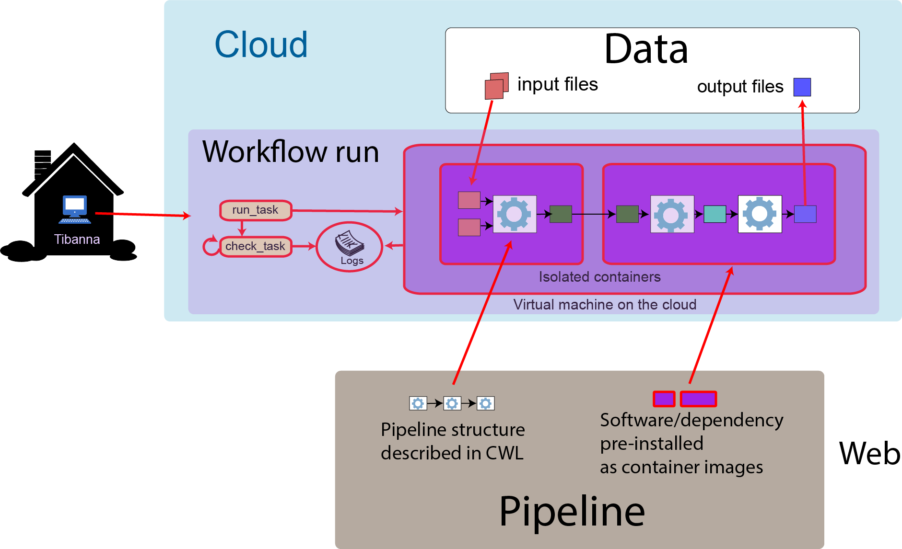

========
Overview
========

Tibanna is a software tool that helps you run genomic pipelines on the cloud.
It is also used by 4DN-DCIC (4D Nucleome Data Coordination and Integration Center) to process data.

What do I need to run pipelines using Tibanna?
----------------------------------------------

- Your pipeline
- Your data
- An Amazon Web Services (AWS) cloud account
- Tibanna

Pipeline
++++++++

- Your pipeline and dependencies must be pre-installed either in a docker image (https://www.docker.com/) or a Singularity image (https://singularity.lbl.gov/)

  - (Singularity works only with CWL v1 but not draft3).

- The commands to run your pipeline must be written in Common Workflow Language. (https://www.commonwl.org/).

Data
++++

- Your data must be in an AWS S3 bucket.

AWS cloud account
+++++++++++++++++

- Confirm that you can log in to AWS_.

.. _AWS: https://aws.amazon.com/

Tibanna
+++++++

- Tibanna is open-source and can be found on github_.
- Once installed, Tibanna can be run either as a set of commend-line tools or a set of python modules.

.. _github: https://github.com/4dn-dcic/tibanna

**Command-line tools**

::

    $ invoke run_workflow --input-json=run1.json

**Python**

::

    >>> from core.utils import run_workflow
    >>> run_workflow(input_json=run1)

Contents:

.. toctree::
   :hidden:

   self

.. toctree::
   :maxdepth: 3

   simple_example
   startaws
   installation
   commands
   execution_json
   monitoring
   cwl
   ami
   pony
   how_it_works

