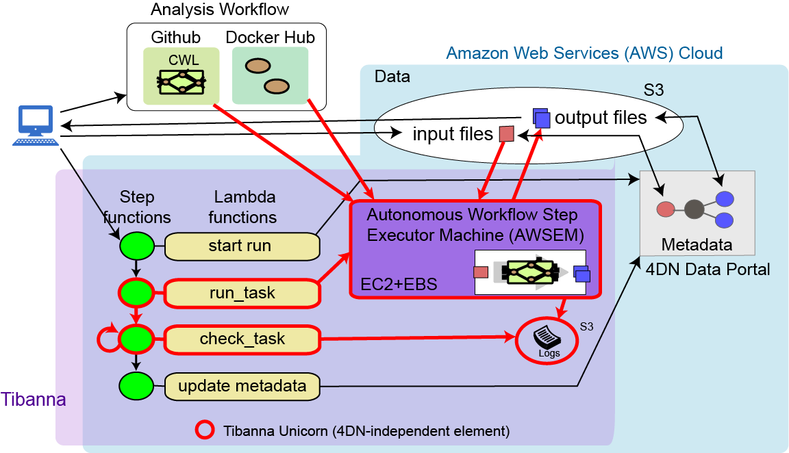

========
Overview
========

Tibanna is auto-triggered upon data submission to execute a relevant workflow on the data. It utilizes two-layer scheduling; an upstream regulator based on a state machine called AWS Step Function and a downstream workflow engine that runs Docker/CWL-based pipelines. Tibanna’s AWS Step Function launches several AWS Serverless Lambda functions that control workflow-related metadata generation/tracking and deployment of a workflow on a pre-custom-configured autonomous virtual machine (EC2 instance) (AWSEM; Autonomous Workflow Step Executor Machine).

In addition, Tibanna offers multi-layer real-time monitoring to ensure the workflows are executed flawlessly. AWSEM sends real time logs from Docker/CWL to a designated S3 Bucket; individual AWS Lambda functions are checked through AWS CloudWatch; AWS Step function communicates with users at the top level. The system allows users to ssh into the EC2 instance where a workflow is currently being executed, to allow detailed investigation. Tibanna uses AWS IAM roles to ensure secure access. We have also implemented an accompanying resource optimizer for Tibanna (https://github.com/4dn-dcic/pipelines-cwl/tree/master/Benchmark), which calculates total CPU, memory and space required for a specific workflow run to determine EC2 instance type and EBS (Elastic Block Store) volume size. The calculation is based on input size, workflow parameters and the benchmarking results characteristic of individual workflows. The resource optimizer is essential for automated parameterization of data-dependent workflow runs, while maximizing the benefit of the elasticity of the cloud platform. Tibanna currently uses this optimizer to auto-determine instance types and EBS sizes for 4DN workflow runs.

Tibanna has been evolving: originally developed for Desktop workflow submitter that launches an autonomous VM, then upgraded to a Chalice/Lambda/API-Gateway-based system that works with the Seven Bridges Genomics (SBG) platform, and it currently consists of the original modules integrated with AWS Step functions for upstream scheduling and monitoring, without SBG.

Contents:

.. toctree::
   :hidden:

   self

.. toctree::
   :maxdepth: 3

   startaws
   installation
   commands
   ami
   unicorn
   pony

