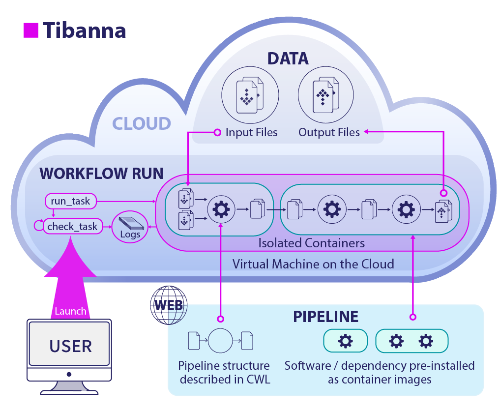

========
Overview
========

Tibanna is a software tool that helps you run genomic pipelines on the the Amazon (AWS) cloud.
It is also used by 4DN-DCIC (4D Nucleome Data Coordination and Integration Center) to process data.

What do I need to run pipelines using Tibanna?
----------------------------------------------

- Your pipeline
- Your data
- An Amazon Web Services (AWS) cloud account
- Tibanna

Pipeline
++++++++

- Your pipeline and dependencies must be pre-installed as a Docker image (https://www.docker.com/).
- The commands to run your pipeline must be written in either Common Workflow Language (CWL_) (recommended), Workflow Description Language (WDL_) (only basic support), Snakemake_ or a list of shell commands.
- The pipelines may be local CWL/WDL/Snakemake files or they should be downloadable from public urls. 

.. _CWL: https://www.commonwl.org/
.. _WDL: https://software.broadinstitute.org/wdl/
.. _Snakemake: https://snakemake.readthedocs.io/en/stable/

Data
++++

- Your data must be in AWS S3 buckets.

AWS cloud account
+++++++++++++++++

- Confirm that you can log in to AWS_.

.. _AWS: https://aws.amazon.com/

Tibanna
+++++++

- Tibanna is open-source and can be found on github_.
- Once installed, Tibanna can be run either as a set of commend-line tools or a set of python modules.

.. _github: https://github.com/4dn-dcic/tibanna

**Command-line tools**

::

    $ tibanna run_workflow --input-json=run1.json

**Python**

::

    >>> from tibanna.core import API
    >>> API().run_workflow(input_json='run1.json')  # input_json is a json file or a dict object

Contents:

.. toctree::
   :hidden:

   self

.. toctree::
   :maxdepth: 4

   news
   simple_example
   startaws
   installation
   commands
   api
   execution_json
   monitoring
   collecting_metrics
   cwl
   wdl
   ami
   4dn_pipelines
   how_it_works
