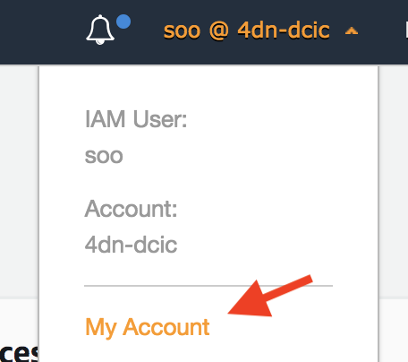
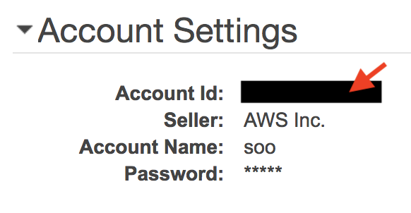

============
Installation
============

Tibanna's installation is two-step - installation of the tibanna package on the local machine and deployment of its serverless components to the AWS Cloud. Since the second step is separated from the first step, one may deploy as many copies of Tibanna as one wishes for different projects, with different bucket permissions and users.

Installing Tibanna package
--------------------------

Tibanna works with the following Python and pip versions.

- Python 3.6
- Pip 9, 10, 18 or 19

Install Tibanna on your local machine or server from which you want to send commands to run workflows.

::

    # create a virtual environment
    virtualenv -p python3.6 ~/venv/tibanna
    source ~/venv/tibanna/bin/activate
  
  
::

    # installing tibanna package
    git clone https://github.com/4dn-dcic/tibanna
    cd tibanna
    pip install -r requirements.txt  # if you're 4dn-dcic, use requirements-4dn.txt instead

Alternatively, use ``setup.py``

::

   # installing tibanna package
    git clone https://github.com/4dn-dcic/tibanna
    cd tibanna
    python setup.py install

AWS configuration
-----------------

To deploy and use Tibanna on the AWS Cloud, you must first have an AWS account.

Deployment requires an admin user credentials. For more details, check out https://aws.amazon.com/.

To only run workflows using Tibanna, you need a regular user credentials.

Once you have the user credentials, we can add that information to the local machine using ``aws configure``. Tibanna uses this information to know that you have the permission to deploy to your AWS account.

::

    aws configure

Type in your keys, region and output format ('json') as below.

::

    AWS Access Key ID [None]: <your_aws_key>
    AWS Secret Access Key [None]: <your_aws_secret_key>
    Default region name [None]: us-east-1
    Default output format [None]: json

To use Tibanna, you need an AWS account and the following environmental variables set and exported on your local machine.

::

    export AWS_ACCOUNT_NUMBER=<your_12_digit_aws_account_number>
    export TIBANNA_AWS_REGION=<aws_region>  # (e.g. us-east-1)

You can find your aws account number from the AWS Web Console.

=================  ========================
|console_account|  |console_account_number|
=================  ========================

Deploying Tibanna to AWS
------------------------

If you're using a forked Tibanna repo or want to use a specific branch, set the following variables as well before deployment. They will be used by the EC2 (VM) instances to grab the right scripts from the `awsf` directory of the right tibanna repo/branch. If you're using default (``4dn-dcic/tibanna``, ``master``), no need to set these variables.

::

    # only if you're using a forked repo
    export TIBANNA_REPO_NAME=<git_hub_repo_name>  # (default: 4dn-dcic/tibanna)
    export TIBANNA_REPO_BRANCH=<git_hub_branch_name>  # (default: master)

Then, deploy a copy of Tibanna as below.

If you want to operate multiple copies of Tibanna (e.g. for different projects), you can try to name each copy of Tibanna using ``--usergroup`` option (by default the name is ``default_<random_number>``).

Here, we're naming it ``hahaha`` - come up with a better name if you want to.

::

    tibanna deploy_unicorn --usergroup=hahaha
    # This will give permission to only public tibanna test buckets.
    # To add permission to other private or public buckets, use --buckets option.

Run a test workflow
-------------------

The above command will first create a usergroup that shares the permission to use a single tibanna environment. Then, it will deploy a tibanna instance (step function / lambda). The name of the tibanna step function is added to your ``~/.bashrc`` file. Check that you can see the following line in the ``~/.bashrc`` file.

::

    # check your ~/.bashrc file
    tail -1 ~/.bashrc

You should be able to see the following.

::

    export TIBANNA_DEFAULT_STEP_FUNCTION_NAME=tibanna_unicorn_hahaha

To set this environmental variable,

::

    source ~/.bashrc

You can run a workflow using Tibanna if you're an admin user or if you are a user that belongs to the user group.

::

    tibanna run_workflow --input-json=<input_json_for_a_workflow_run>

As an example you can try to run a test workflow as below. This one uses only public buckets ``my-tibanna-test-bucket`` and ``my-tibanna-test-input-bucket``. The public has permission to these buckets - the objects will expire in 1 day and others may have access to the same bucket and read/overwrite/delete your objects. Please use it only for initial testing of Tibanna.

::

    tibanna run_workflow --input-json=test_json/unicorn/my_test_tibanna_bucket.json

Deploying Tibanna with private buckets
--------------------------------------

Creating a bucket
+++++++++++++++++

You can skip this section if you want to use existing buckets for input/output/logs.

If you are an admin or have a permission to create a bucket, you can either use the AWS Web Console or use the following command using `awscli`. For example, a data (input/output) bucket and a tibanna log bucket may be created. You could also separate input and output buckets, or have multiple input buckets, etc. Bucket names are globally unique.

::

    aws s3api create-bucket --bucket <bucketname>

**Example**

::

    aws s3api create-bucket --bucket montys-data-bucket  # choose your own data bucket name
    aws s3api create-bucket --bucket montys-tibanna-log-bucket  # choose your own log bucket name

Upload your files to the data bucket by using the following

::

    aws s3 cp <filename> s3://<bucketname>/<filename>
    aws s3 cp -R <dirname> s3://<bucketname>/<dirname>

**Example**

::

    aws s3 cp somebamfile.bam s3://montys-data-bucket/somebamfile.bam
    aws s3 cp -R montys-input-data-folder s3://montys-data-bucket/montys-input-data-folder

Deploying Tibanna
+++++++++++++++++

Let's try setting up Tibanna that uses private buckets. As you deploy your tibanna, add your private bucket names.
Again, you can name this new copy of Tibanna by specifying a new user group (e.g. ``lalala``.)

::

    tibanna deploy_unicorn --buckets=<bucket1>,<bucket2>,... --usergroup=lalala

**Example**

::

    tibanna deploy_unicorn --buckets=montys-data-bucket,montys-tibanna-log-bucket \
                          --usergroup=lalala

    # no space between bucket names!

Export the environmental variable for Tibanna step function name.

::

    source ~/.bashrc

Create an input json using your buckets.

Then, run workflow.

::

    tibanna run_workflow --input-json=<input_json>

Now we have two different copies of deployed Tibanna. According to your `~/.bashrc`, the latest deployed copy is your default copy. However, if you want to run a workflow on a different copy of Tibanna, use ``--sfn`` option. For example, now your default copy is ``lalala`` (the latest one), but you want to run our workflow on ``hahaha``. Then, do the following.

::

    tibanna run_workflow --input-json=<input_json> --sfn=tibanna_unicorn_hahaha

User permission
---------------

To deploy Tibanna, one must be an admin for an AWS account.
To run a workflow, the user must be either an admin or in the IAM group ``tibanna_<usergroup>``. To add a user to a user group, you have to be an admin. To do this, use the ``tibanna`` command.

::
 
    tibanna users

You will see the list of users.

**Example**

::

    user	tibanna_usergroup
    soo
    monty	

This command will print out the list of users.

::

    tibanna add_users --user=<user> --group=<usergroup>

For example, if you have a user named ``monty`` and you want to give permission to this user to user Tibanna ``lalala``. This will give this user permission to run and monitor the workflow, access the buckets that Tibanna usergroup ``lalala``  was given access to through ``tibanna deploy_unicorn --buckets=<b1>,<b2>,...``

::

    tibanna add_uesrs --user=monty --group=lalala

Check users again.

::

    tibanna users

::

    user	tibanna_usergroup
    soo
    monty	lalala

Now ``monty`` can use ``tibanna_unicorn_lalala`` and access buckets ``montys-data-bucket`` and ``montys-tibanna-log-bucket``

