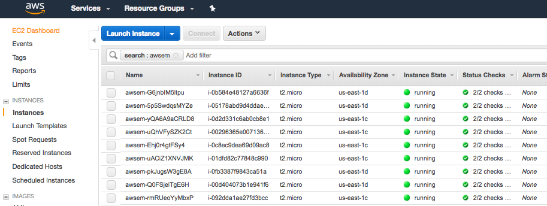
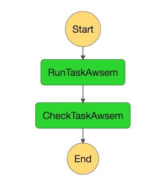
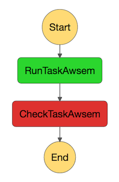
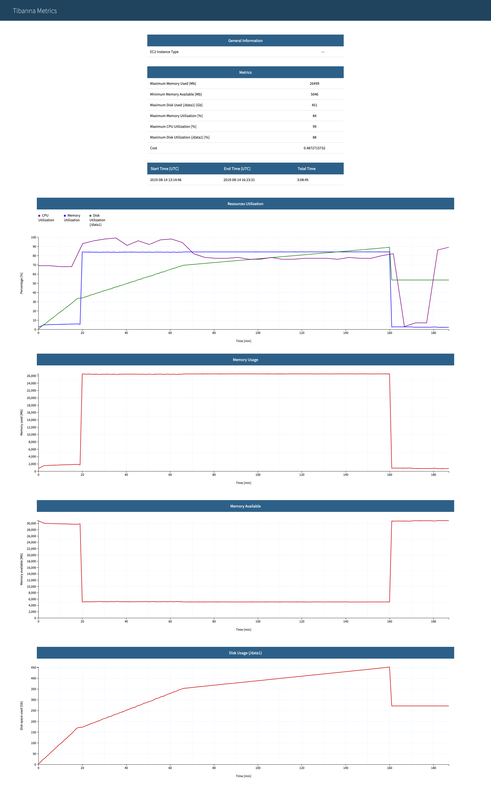

=========================
Monitoring a workflow run
=========================

Monitoring can be done either from the Step Function Console through a Web Browser, or through command-line.

Command-line
------------

General stats
+++++++++++++

::

    tibanna stat [--sfn=<stepfunctioname>] [--status=RUNNING|SUCCEEDED|FAILED|TIMED_OUT|ABORTED] [-l] [-n <number_of_lines>]

The output is a table (an example below)

::

    jobid       status  name    start_time      stop_time
    2xPih7reR6FM        RUNNING md5        2018-08-15 17:45        2018-08-15 17:50
    3hbkJB3hv92S        SUCCEEDED       hicprocessingbam   2018-08-15 16:04        2018-08-15 16:09
    UlkvH3gbBBA2        FAILED  repliseq-parta     2018-08-09 18:26        2018-08-09 19:01
    j7hvisheBV27        SUCCEEDED       bwa-mem    2018-08-09 18:44        2018-08-09 18:59

To print out more information, use the ``-l`` (long) option. The additional information includes the ID, type, status and public ip of the EC2 instance. Keyname and Password information is shown for ssh.

::

    jobid	status	name	start_time	stop_time	instance_id	instance_type	instance_status	ip	key	password
    O37462jD9Kf7	RUNNING	bwa-mem	2018-12-14 23:37	2018-12-14 23:40	i-009880382ee22a5b1	t2.large	running 3.25.66.32	4dn-encode      somepassword
    jN4ubJNlNKIi	ABORTED	bwa-mem	2018-12-14 23:33	2018-12-14 23:36	i-0df66d22d485bbc05	c4.4xlarge	shutting-down   -	-       -
    dWBRxy0R8LXi	SUCCEEDED	bwa-mem	2018-12-14 22:44	2018-12-14 22:59	i-00f222fe5e4580007	t3.medium	terminated	-	-       -

Using ``-n`` limits the number of lines to be printed. (the most recent ``n`` items will be printed)

Execution logs
++++++++++++++

Log
###

Using your job ID, you can also check your S3 bucket to see if you can find a file named <jobid>.log. This will happen 5~10min after you start the process, because it takes time for an instance to be ready and send the log file to S3. The log file gets updated, so you can re-download this file and check the progress. Checking the log file can be done through the ``tibanna log`` command. For example, to view the last 60 lines of the log for job ``lSbkdVIQ6VtX``,

::

    tibanna log --job-id=lSbkdVIQ6VtX | tail  -60

::

    "atac.conservative_peak": "/data1/wdl/cromwell-executions/atac/14efe06b-a010-42c9-be0f-82f33f4d877c/call-reproducibility_overlap/execution/glob-c12e49ae1deb87ae04019b575ae1ffe9/conservative_peak.narrowPeak.bb"
    }
    [2019-02-04 17:09:59,15] [info] WorkflowManagerActor WorkflowActor-14efe06b-a010-42c9-be0f-82f33f4d877c is in a terminal state: WorkflowSucceededState
    [2019-02-04 17:10:41,23] [info] SingleWorkflowRunnerActor workflow finished with status 'Succeeded'.
    {
      "outputs": {
        "atac.optimal_peak": "/data1/wdl/cromwell-executions/atac/14efe06b-a010-42c9-be0f-82f33f4d877c/call-reproducibility_overlap/execution/glob-6150deffcc38df7a1bcd007f08a547cd/optimal_peak.narrowPeak.bb",
        "atac.sig_fc": "/data1/wdl/cromwell-executions/atac/14efe06b-a010-42c9-be0f-82f33f4d877c/call-macs2_pooled/execution/glob-8876d8ced974dc46a0c7a4fac20a3a95/4DNFIZYWOA3Y.pooled.fc.signal.bigwig",
        "atac.report": "/data1/wdl/cromwell-executions/atac/14efe06b-a010-42c9-be0f-82f33f4d877c/call-qc_report/execution/glob-eae855c82d0f7e2185388856e7b2cc7b/qc.html",
        "atac.first_ta": null,
        "atac.qc_json": "/data1/wdl/cromwell-executions/atac/14efe06b-a010-42c9-be0f-82f33f4d877c/call-qc_report/execution/glob-3440f922973abb7a616aaf203e0db08b/qc.json",
        "atac.conservative_peak": "/data1/wdl/cromwell-executions/atac/14efe06b-a010-42c9-be0f-82f33f4d877c/call-reproducibility_overlap/execution/glob-c12e49ae1deb87ae04019b575ae1ffe9/conservative_peak.narrowPeak.bb"
      },
      "id": "14efe06b-a010-42c9-be0f-82f33f4d877c"
    }
    [2019-02-04 17:10:43,02] [info] SingleWorkflowRunnerActor writing metadata to /data1/out/lSbkdVIQ6VtX.log.json
    [2019-02-04 17:10:43,03] [info] Workflow polling stopped
    [2019-02-04 17:10:43,04] [info] Shutting down WorkflowStoreActor - Timeout = 5 seconds
    [2019-02-04 17:10:43,05] [info] Shutting down WorkflowLogCopyRouter - Timeout = 5 seconds
    [2019-02-04 17:10:43,05] [info] Shutting down JobExecutionTokenDispenser - Timeout = 5 seconds
    [2019-02-04 17:10:43,05] [info] JobExecutionTokenDispenser stopped
    [2019-02-04 17:10:43,06] [info] Aborting all running workflows.
    [2019-02-04 17:10:43,06] [info] WorkflowStoreActor stopped
    [2019-02-04 17:10:43,06] [info] WorkflowLogCopyRouter stopped
    [2019-02-04 17:10:43,06] [info] Shutting down WorkflowManagerActor - Timeout = 3600 seconds
    [2019-02-04 17:10:43,06] [info] WorkflowManagerActor All workflows finished
    [2019-02-04 17:10:43,06] [info] WorkflowManagerActor stopped
    [2019-02-04 17:10:43,06] [info] Connection pools shut down
    [2019-02-04 17:10:43,06] [info] Shutting down SubWorkflowStoreActor - Timeout = 1800 seconds
    [2019-02-04 17:10:43,06] [info] Shutting down JobStoreActor - Timeout = 1800 seconds
    [2019-02-04 17:10:43,06] [info] Shutting down CallCacheWriteActor - Timeout = 1800 seconds
    [2019-02-04 17:10:43,06] [info] SubWorkflowStoreActor stopped
    [2019-02-04 17:10:43,06] [info] Shutting down ServiceRegistryActor - Timeout = 1800 seconds
    [2019-02-04 17:10:43,06] [info] Shutting down DockerHashActor - Timeout = 1800 seconds
    [2019-02-04 17:10:43,06] [info] Shutting down IoProxy - Timeout = 1800 seconds
    [2019-02-04 17:10:43,07] [info] KvWriteActor Shutting down: 0 queued messages to process
    [2019-02-04 17:10:43,07] [info] WriteMetadataActor Shutting down: 0 queued messages to process
    [2019-02-04 17:10:43,07] [info] CallCacheWriteActor Shutting down: 0 queued messages to process
    [2019-02-04 17:10:43,07] [info] CallCacheWriteActor stopped
    [2019-02-04 17:10:43,07] [info] DockerHashActor stopped
    [2019-02-04 17:10:43,07] [info] IoProxy stopped
    [2019-02-04 17:10:43,07] [info] ServiceRegistryActor stopped
    [2019-02-04 17:10:43,07] [info] JobStoreActor stopped
    [2019-02-04 17:10:43,08] [info] Database closed
    [2019-02-04 17:10:43,08] [info] Stream materializer shut down
    [2019-02-04 17:10:43,08] [info] WDL HTTP import resolver closed
    Mon Feb  4 17:10:44 UTC 2019
    total 228K
    -rw-r--r-- 1 root   root 144K Feb  4 17:10 lSbkdVIQ6VtX.log.json
    -rw-r--r-- 1 root   root    0 Feb  4 17:10 lSbkdVIQ6VtX.md5sum.txt
    -rwxr-xr-x 1 ubuntu root  78K Feb  4 17:10 lSbkdVIQ6VtX.log
    Filesystem      Size  Used Avail Use% Mounted on
    udev             16G     0   16G   0% /dev
    tmpfs           3.1G  8.5M  3.1G   1% /run
    /dev/nvme0n1p1  7.7G  5.9G  1.9G  76% /
    tmpfs            16G     0   16G   0% /dev/shm
    tmpfs           5.0M     0  5.0M   0% /run/lock
    tmpfs            16G     0   16G   0% /sys/fs/cgroup
    /dev/nvme1n1     90G  8.4G   77G  10% /data1

To Download the log file manually, the following command also works.

::

    aws s3 cp s3://<tibanna_lob_bucket_name>/<jobid>.log .

Postrun.json
############

Once the job is finished, you should be able to find the ``<jobid>.postrun.json`` file as well. This file can be viewed likewise using the ``tibanna log`` command, but with the ``-p`` option. The postrun json file contains the summary of the run, including the input / output / EC2 configuration and Cloudwatch metrics for memory/CPU/disk space usage.

::

   tibanna log -p --job-id=lSbkdVIQ6VtX

::

    {
        "Job": {
            "status": "0", 
            "Metrics": {
                "max_cpu_utilization_percent": 86.4, 
                "max_mem_used_MB": 14056.421875, 
                "max_mem_utilization_percent": 45.124831006539534, 
                "max_disk_space_utilization_percent": 72.0912267060547, 
                "total_mem_MB": 31150.08203125, 
                "max_mem_available_MB": 17093.66015625, 
                "max_disk_space_used_GB": 64.4835815429688
            }, 
            "total_tmp_size": "4.0K", 
            "Log": {
                "log_bucket_directory": "tibanna-output"
            }, 
            "App": {
                "main_wdl": "atac.wdl", 
                "other_cwl_files": "", 
                "App_name": "encode-atacseq-postaln", 
                "language": "wdl", 
                "other_wdl_files": "", 
                "main_cwl": "", 
                "cwl_url": "", 
                "wdl_url": "https://raw.githubusercontent.com/4dn-dcic/atac-seq-pipeline/master/", 
                "App_version": "1.1.1"
            }, 
            "filesystem": "/dev/nvme1n1", 
            "JOBID": "lSbkdVIQ6VtX", 
            "instance_id": "i-06fc45b29b47a1703", 
            "end_time": "20190204-17:11:01-UTC", 
            "total_input_size": "829M", 
            "Input": {
                "Input_files_data": {
                    "atac.chrsz": {
                        "profile": "", 
                        "path": "9866d158-da3c-4d9b-96a9-1d59632eabeb/4DNFIZJB62D1.chrom.sizes", 
                        "rename": "", 
                        "class": "File", 
                        "dir": "elasticbeanstalk-fourfront-webprod-files"
                    }, 
                    "atac.blacklist": {
                        "profile": "", 
                        "path": "9562ffbd-9f7a-4bd7-9c10-c335137d8966/4DNFIZ1TGJZR.bed.gz", 
                        "rename": "", 
                        "class": "File", 
                        "dir": "elasticbeanstalk-fourfront-webprod-files"
                    }, 
                    "atac.tas": {
                        "profile": "", 
                        "path": [
                            "b08d0ea3-2d95-4306-813a-f2e956a705a9/4DNFIZYWOA3Y.bed.gz", 
                            "0565b17b-4012-4d4d-9914-a4a993717db8/4DNFIZDSO341.bed.gz"
                        ], 
                        "rename": [
                            "4DNFIZYWOA3Y.tagAlign.gz", 
                            "4DNFIZDSO341.tagAlign.gz"
                        ], 
                        "class": "File", 
                        "dir": "elasticbeanstalk-fourfront-webprod-wfoutput"
                    }
                }, 
                "Secondary_files_data": {
                    "atac.tas": {
                        "profile": "", 
                        "path": [
                            null, 
                            null
                        ], 
                        "rename": [
                            "4DNFIZYWOA3Y.tagAlign.gz", 
                            "4DNFIZDSO341.tagAlign.gz"
                        ], 
                        "class": "File", 
                        "dir": "elasticbeanstalk-fourfront-webprod-wfoutput"
                    }
                }, 
                "Env": {}, 
                "Input_parameters": {
                    "atac.pipeline_type": "atac", 
                    "atac.paired_end": true, 
                    "atac.enable_xcor": false, 
                    "atac.disable_ataqc": true, 
                    "atac.gensz": "hs"
                }
            }, 
            "Output": {
                "output_target": {
                    "atac.conservative_peak": "b8a245d2-89c3-44d3-886c-4cd895f9d535/4DNFICOQGQSK.bb", 
                    "atac.qc_json": "2296ea28-d09a-41ba-afb9-1cbfafb1898b/atac.qc_json16152683435", 
                    "atac.report": "2296ea28-d09a-41ba-afb9-1cbfafb1898b/atac.report34127308390", 
                    "atac.optimal_peak": "65023676-be5c-4497-927c-a796a4c302fe/4DNFIY43X8IO.bb", 
                    "atac.sig_fc": "166659d9-2d6f-440f-b404-b7fe0109e8c5/4DNFI5BWWMR7.bw"
                }, 
                "secondary_output_target": {}, 
                "output_bucket_directory": "elasticbeanstalk-fourfront-webprod-wfoutput", 
                "Output files": {
                    "atac.conservative_peak": {
                        "path": "/data1/wdl/cromwell-executions/atac/14efe06b-a010-42c9-be0f-82f33f4d877c/call-reproducibility_overlap/execution/glob-c12e49ae1deb87ae04019b575ae1ffe9/conservative_peak.narrowPeak.bb", 
                        "target": "b8a245d2-89c3-44d3-886c-4cd895f9d535/4DNFICOQGQSK.bb"
                    }, 
                    "atac.qc_json": {
                        "path": "/data1/wdl/cromwell-executions/atac/14efe06b-a010-42c9-be0f-82f33f4d877c/call-qc_report/execution/glob-3440f922973abb7a616aaf203e0db08b/qc.json", 
                        "target": "2296ea28-d09a-41ba-afb9-1cbfafb1898b/atac.qc_json16152683435"
                    }, 
                    "atac.report": {
                        "path": "/data1/wdl/cromwell-executions/atac/14efe06b-a010-42c9-be0f-82f33f4d877c/call-qc_report/execution/glob-eae855c82d0f7e2185388856e7b2cc7b/qc.html", 
                        "target": "2296ea28-d09a-41ba-afb9-1cbfafb1898b/atac.report34127308390"
                    }, 
                    "atac.optimal_peak": {
                        "path": "/data1/wdl/cromwell-executions/atac/14efe06b-a010-42c9-be0f-82f33f4d877c/call-reproducibility_overlap/execution/glob-6150deffcc38df7a1bcd007f08a547cd/optimal_peak.narrowPeak.bb", 
                        "target": "65023676-be5c-4497-927c-a796a4c302fe/4DNFIY43X8IO.bb"
                    }, 
                    "atac.sig_fc": {
                        "path": "/data1/wdl/cromwell-executions/atac/14efe06b-a010-42c9-be0f-82f33f4d877c/call-macs2_pooled/execution/glob-8876d8ced974dc46a0c7a4fac20a3a95/4DNFIZYWOA3Y.pooled.fc.signal.bigwig", 
                        "target": "166659d9-2d6f-440f-b404-b7fe0109e8c5/4DNFI5BWWMR7.bw"
                    }
                }, 
                "alt_cond_output_argnames": []
            }, 
            "total_output_size": "232K", 
            "start_time": "20190204-15:28:30-UTC"
        }, 
        "config": {
            "ebs_size": 91, 
            "cloudwatch_dashboard": true, 
            "ami_id": "ami-0f06a8358d41c4b9c", 
            "language": "wdl", 
            "json_bucket": "4dn-aws-pipeline-run-json", 
            "json_dir": "/tmp/json", 
            "EBS_optimized": true, 
            "ebs_iops": "", 
            "userdata_dir": "/tmp/userdata", 
            "shutdown_min": "now", 
            "instance_type": "c5.4xlarge", 
            "public_postrun_json": true, 
            "ebs_type": "gp2", 
            "script_url": "https://raw.githubusercontent.com/4dn-dcic/tibanna/master/awsf/", 
            "job_tag": "encode-atacseq-postaln", 
            "log_bucket": "tibanna-output"
        }, 
        "commands": []
    }
 
To Download the postrun json file manually, the following command also works.

::

    aws s3 cp s3://<tibanna_lob_bucket_name>/<jobid>.postrun.json .

DEBUG tar ball
##############

For WDL, a more comprehensive log is provided as ``<jobid>.debug.tar.gz`` in the same log bucket, starting from version 0.5.3. This file is a tar ball created by the following command on the EC2 instance:

::

    cd /data1/wdl/
    find . -type f -name 'stdout' -or -name 'stderr' -or -name 'script' -or \
    -name '*.qc' -or -name '*.txt' -or -name '*.log' -or -name '*.png' -or -name '*.pdf' \
    | xargs tar -zcvf debug.tar.gz

You can download this file using a ``aws s3 cp`` command.

::

    aws s3 cp s3://<tibanna_lob_bucket_name>/<jobid>.debug.tar.gz .

Detailed monitoring through ssh
+++++++++++++++++++++++++++++++

You can also ssh into your running instance to check more details. The IP of the instance can be found using ``tibanna stat -v``

::

    ssh ubuntu@<ip>

if ``keyname`` was provided in the input execution json,

::

    ssh -i <keyfilename>.pem ubuntu@<ip>

The keyname (and/or password) can also be found using ``tibanna stat -v``.

Alternatively, the Step Function execution page of AWS Web Console contains details of the ssh options. ``keyname`` and ``password`` can be found inside the input json of the execution. The IP can be found inside the output json of the ``RunTaskAwsem`` step or the input json of the ``CheckTaskAwsem`` step.

The purpose of the ssh is to monitor things, so refrain from doing various things there, which could interfere with the run. It is recommended, unless you're a developer, to use the log file than ssh.

The instance may be set to run for some time after the run finishes, to allow debugging time with the ssh option. This parameter (in minutes) can be set in the ``shutdown_min`` field inside the ``config`` field of the input execution json.

On the instance, one can check the following, for example.

For CWL,

- ``/data1/input/`` : input files
- ``/data1/tmp*`` : temp/intermediate files (need sudo access)
- ``/data1/output/`` : output files (need sudo access)
- ``top`` : to see what processes are running and how much cpu/memory is being used
- ``ps -fe`` : to see what processes are running, in more detail

For WDL,

- ``/data1/input/`` : input files
- ``/data1/wdl/cromwell-execution/*`` : temp/intermediate files, output files and logs
- ``top`` : to see what processes are running and how much cpu/memory is being used
- ``ps -fe`` : to see what processes are running, in more detail

Console
-------

EC2 instances
+++++++++++++

You can also check from the Console the instance that is running which has a name awsem-<jobid>. It will terminate itself when the run finishes. You won't have access to terminate this or any other instance, but if something is hanging for too long, please contact the admin to resolve the issue.

Step functions
++++++++++++++

When the run finishes successfully, you'll see in your bucket a file <jobid>.success. If there was an error, you will see a file <jobid>.error instead. The step functions will look green on every step, if the run was successful. If one of the steps is red, it means it failed at that step.

=========================  ======================
        Success                   Fail
=========================  ======================
|unicorn_stepfun_success|  |unicorn_stepfun_fail|
=========================  ======================

Cloud Watch
+++++++++++

Cloudwatch dashboard option is now disabled and replaced by the resource metric report that is generated by the ``plot_metrics`` command.

Resource Metrics Report
-----------------------

Tibanna can collect Cloud Watch metrics on used resources in real time for each run. The metrics are saved as tsv files together with an html report automatically created for visualization.
The metrics are collected by 1 minute interval or 5 minute interval depending on the availability on Cloud Watch. The metrics and html files created are uploaded to an S3 bucket.

plot_metrics
============
This command allows to save Cloud Watch data collected in the required time interval and creates an html report for the visualization.

By default the command will retrieve the data from cloud watch, and creates several files:

  - a metrics.tsv file containing all the data points
  - a metrics_report.tsv containing the average statistics and other information about the EC2 instance
  - a metrics.html report for visualization

All the files are eventually uploaded to a folder named <jobid>.metrics inside the log S3 bucket specified for tibanna output.
To visualize the html report the URL structure is: ``https://<log-bucket>.s3.amazonaws.com/<jobid>.metrics/metrics.html``

**Basic Command**

::

  tibanna plot_metrics --job-id=<jobid> [<options>]

**Options**

::

  -s|--sfn=<stepfunctionname>         An example step function name may be
                                      'tibanna_unicorn_defaut_3978'. If not specified, default
                                      value is taken from environmental variable
                                      TIBANNA_DEFAULT_STEP_FUNCTION_NAME. If the environmental
                                      variable is not set, it uses name 'tibanna_pony' (4dn
                                      default, works only for 4dn).

  -f|--force-upload                   Upload the metrics reports to the S3 bucket even
                                      if there is a lock file (upload is blocked by default
                                      by the lock)

  -u|--update-html-only               Update only the html file for metrics visualization

  -B|--do-not-open-browser            Do not open the browser to visualize the metrics html
                                      after it has been created/updated

When metrics are collected for a run that is complete, a lock file is automatically created inside the same folder. The command will not update the metrics files if a lock file is present. To override this behavior the ``--force-upload`` flag allows to upload the metrics files ignoring the lock.
The ``--update-html-only`` allows to only update the metrics.html file without modifying the other tsv files.
By default the command will open the html report in the browser for visualization when execution is complete, ``--do-not-open-browser`` can be added to prevent this behavior.

Metrics collected
+++++++++++++++++

The metrics that are collected are:

  - EC2 Instance type
----

  - Memory, Disk, and CPU utilization as a percentage of the maximum resources available for the EC2 instance
  - Memory used in Mb
  - Memory available in Mb
  - Disk used in Gb
----

  - Start time, end time, and total elapsed time

html report example
+++++++++++++++++++

cost
====

This command allows to retrieve the cost for the run. The cost is not immediately ready and usually requires few days to become available. The command eventually allows to update the information obtained with plot_metrics by adding the cost.

::

 tibanna cost --job-id=<jobid> [<options>]

**Options**

::

 -s|--sfn=<stepfunctionname>         An example step function name may be
                                     'tibanna_unicorn_defaut_3978'. If not specified, default
                                     value is taken from environmental variable
                                     TIBANNA_DEFAULT_STEP_FUNCTION_NAME. If the environmental
                                     variable is not set, it uses name 'tibanna_pony' (4dn
                                     default, works only for 4dn).

 -u|--update-tsv                     Update with the cost the tsv file that stores metrics
                                     information on the S3 bucket
