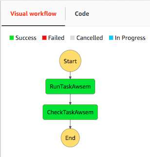
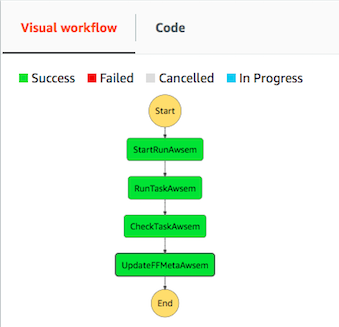

=========================
Tibanna Pony for 4DN-DCIC
=========================

Tibanna Pony is an extension of Tibanna Unicorn used specifically for 4DN-DCIC (4D Nucleome Data Coordination and Integration Center). Pony has two additional steps that communicate with the 4DN Data Portal and handle 4DN metadata. Pony is only for 4DN-DCIC and requires access keys to the Data Portal and the 4DN DCIC AWS account.

=================  ==================
 Tibanna Unicorn    Tibanna Pony
=================  ==================
|tibanna_unicorn|  |tibanna_pony|
=================  ==================

Example Tibanna setup for 4DN-DCIC
----------------------------------

To deploy pony, you could do the following. (already done)

::

    invoke setup_tibanna_env --buckets=elasticbeanstalk-fourfront-webdev-files,elasticbeanstalk-fourfront-webdev-wfoutput,tibanna-output,4dn-aws-pipeline-run-json

Webdev testing for Pony
-----------------------

For full tibanna test (actually running jobs through step function) besides travis test, the following input json files are used.

::

    test_json/pony/md5.json  
    test_json/pony/fastqc.json
    test_json/pony/bwa_new.json
    test_json/pony/pairsqc.json
    test_json/pony/hicpairs_easy.json
    test_json/pony/hic_processing_bam-2.pony.json
    test_json/pony/repliseq_parta-pony.json

- note: these files are listed in ``tests/webdevtestlist``. One could use this file for batch testing for a given tibanna pony instance like an example below for Mac (replace tibanna_pony_uno with your step function mame).

::

    cat tests/webdevtestlist | xargs -I{} sh -c "invoke run_workflow --workflow=tibanna_pony_dev --input-json={}"

Example Input Json for Pony
---------------------------

::

    {
        "app_name": "bwa-mem",
        "output_bucket": "elasticbeanstalk-fourfront-webdev-wfoutput",
        "workflow_uuid": "0fbe4db8-0b5f-448e-8b58-3f8c84baabf5",
        "parameters" :  {"nThreads": 4},
        "input_files" : [
           {
               "object_key": "4DNFIZQZ39L9.bwaIndex.tgz",
               "workflow_argument_name": "bwa_index",
               "uuid": "1f53df95-4cf3-41cc-971d-81bb16c486dd",
               "bucket_name": "elasticbeanstalk-fourfront-webdev-files",
               "rename": "hg38.tar.gz"
           },
           {
               "workflow_argument_name": "fastq1",
               "bucket_name": "elasticbeanstalk-fourfront-webdev-files",
               "uuid": "1150b428-272b-4a0c-b3e6-4b405c148f7c",
               "object_key": "4DNFIVOZN511.fastq.gz"
           },
           {
               "workflow_argument_name": "fastq2",
               "bucket_name": "elasticbeanstalk-fourfront-webdev-files",
               "uuid": "f4864029-a8ad-4bb8-93e7-5108f462ccaa",
               "object_key": "4DNFIRSRJH45.fastq.gz"
           }
      ],
      "config": {
        "ebs_size": 30,
        "ebs_type": "io1",
        "json_bucket": "4dn-aws-pipeline-run-json",
        "ebs_iops": 500,
        "shutdown_min": 30,
        "copy_to_s3": true,
        "launch_instance": true,
        "password": "dragonfly",
        "log_bucket": "tibanna-output",
        "key_name": "",
        "spot_instance": true,
        "spot_duration": 360,
        "behavior_on_capacity_limit": "wait_and_retry"
      },
      "custom_pf_fields": {
        "out_bam": {
            "genome_assembly": "GRCh38"
        }
      },
      "wfr_meta": {
        "notes": "a nice workflow run"
      },
      "custom_qc_fields": {
        "award": "/awards/5UM1HL128773-04/",
        "lab": "/labs/bing-ren-lab/"
      },
      "push_error_to_end": true
      "dependency": {
        "exec_arn": [
            "arn:aws:states:us-east-1:643366669028:execution:tibanna_unicorn_default_7412:md5_test",
            "arn:aws:states:us-east-1:643366669028:execution:tibanna_unicorn_default_7412:md5_test2"
        ]
      },
      "overwrite_input_extra": false,
      "cloudwatch_dashboard", false,
      "email": true
    }

- The ``app_name`` field contains the name of the workflow.
- The ``output_bucket`` field specifies the bucket where all the output files go to.
- The ``workflow_uuid`` field contains the uuid of the 4DN workflow metadata.
- The ``parameters`` field contains a set of workflow-specific parameters in a dictionary.
- The ``input_files`` field specifies the argument names (matching the names in CWL), the input file metadata uuid and its bucket and object key name.

  - ``workflow_argument_name``, ``bucket``, ``uuid`` and ``object_key`` are required fields.
  - ``rename`` (optional) can be used to rename a file upon download from s3 to an instance where the workflow will be executed.

- The ``config`` field is directly passed on to the second step, where instance_type, ebs_size, EBS_optimized are auto-filled, if not given.
- The ``custom_pf_fields`` field (optional) contains a dictionary that can be directly passed to the processed file metadata. The key may be either ``ALL`` (applies to all processed files) or the argument name for a specific processed file (or both).
- The ``wfr_meta`` field (optional) contains a dictionary that can be directly passed to the workflow run metadata.
- The ``custom_qc_fields`` field (optional) contains a dictionary that can be directly passed to an associated Quality Metric object.
- The ``push_error_to_end`` field (optional), if set true, passes any error to the last step so that the metadata can be updated with proper error status. (default true)
- The ``dependency`` field (optional) sets dependent jobs. The job will not start until the dependencies successfully finish. If dependency fails, the current job will also fail. The ``exec_arn`` is the list of step function execution arns. The job will wait at the run_task_awsem step, not at the start_task_awsem step (for consistenty with unicorn). This field will be passed to run_task_awsem as ``dependency`` inside the ``args`` field.
- The ``overwrite_input_extra`` (optional) allows overwriting on an existing extra file, if the workflow hasan output of type ``Output to-be-extra-input file`` (i.e., creating an extra file of an input rather than creating a new processed file object). Default ``false``.
- The ``cloudwatch_dashboard`` field (optional), if set ``true``, creates a cloudwatch dashboard for the job, which allows users to trace memory, disk and CPU utilization during and after the run.
- The ``spot_instance`` field (optional), if set ``true``, requests a spot instance instead of an on-demand instance.
- The ``spot_duration`` field (optional), if set, requests a fixed-duration spot instance instead of a regular spot instance. The value is the duration in minutes. This field has no effect if ``spot_instance`` is either ``false`` or not set.
- The ``email`` field (optional), if set ``true``, sends a notification email to ``4dndcic@gmail.com`` when a workflow run finishes.
- The ``behavior_on_capacity_limit`` field (optional) sets the behavior of Tibanna in case AWS instance Limit or Spot instance capacity limit is encountered. Default value is ``fail``. If set to ``wait_and_retry``, Tibanna will wait until the instance becomes available and rerun (10 min interval, for 1 week). If ``spot_instance`` is ``true`` and ``behavior_on_capacity_limit`` is set to ``retry_without_spot``, when the spot instance is not available, it will automatically switch to a regular instance of the same type (applicable only when ``spot_instance`` is ``true``).

