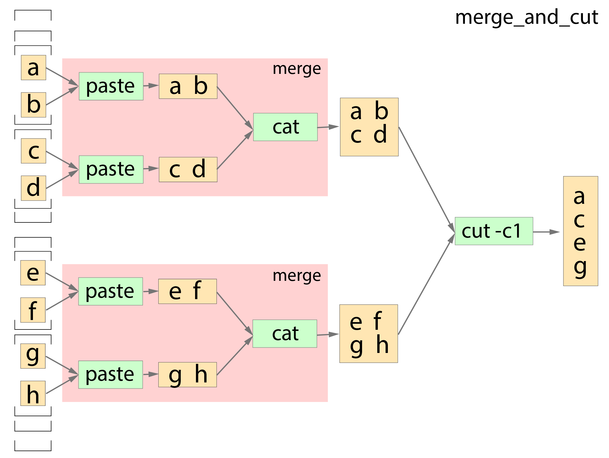

merge_and_cut
-------------

This pipeline is an example of a double-nested input file array (e.g. ``[[[f1, f2], [f3, f4]], [[f5, f6], [f7, f8]]]``).
It consists of a subworkflow called ``merge`` (previous section) and an extra step called ``cut``. ``Merge`` consists of two steps, ``paste`` and ``cat``, the former pastes input files horrizontally and the latter concatenates input files vertically. ``Cut`` prints the first letter of every line from a list of files. Since we're using generic commands, we do not need to create a pipeline software component or a Docker image. We will use the existing ``ubuntu:16.04`` Docker image. So, we will just do the following three steps.

1. create the pipeline description using either *CWL* or *WDL*.
2. prepare for a job definition that specifies pipeline, input files, parameters, resources, output target, etc.
3. run Tibanna.
 

Data
++++

For input data, let's use files named ``smallfile1``, ``smallfile2``, ... ``smallfile8`` in a public bucket named ``my-tibanna-test-input-bucket``. Each of these files contains a letter ('``a``', '``b``', ... ,  '``h``', respectively). We feed an array of array of array of these files in the following format:

  ::

      [
        [[smallfile1, smallfile2], [smallfile3, smallfile4]],
        [[smallfile5, smallfile6], [smallfile7, smallfile8]]
      ]

(You could also upload your own file to your own bucket and set up Tibanna to access that bucket.)

Pipeline description
++++++++++++++++++++

Thie pipeline takes an input 'smallfiles' which is an array of array of array of files. The 3D input is scattered into 2D arrays to the first subworkflow ``merge``, which internally scatters each of the 2D arrays into 1D at the step ``paste`` and put it through another step ``cat`` which produces a single file. Therefore, each 2D array has an output of a single file. The result of these outputs are combined into an array and fed to the extra step ``cut``.

CWL
###

    The structure of this pipeline is a bit complex and we use five CWL files, three of which are identical to the ones from ``merge`` workflow example (``merge.cwl``, ``paste.cwl``, ``cat.cwl``) since we're using the ``merge`` workflow as a subworkflow. There is one master CWL (``merge_and_cut.cwl``) and an extra step CWL, ``cut.cwl``.
    
    These CWL files can be found at the following URLs:

    - https://raw.githubusercontent.com/4dn-dcic/tibanna/master/examples/merge_and_cut/merge_and_cut.cwl
    - https://raw.githubusercontent.com/4dn-dcic/tibanna/master/examples/merge_and_cut/merge.cwl
    - https://raw.githubusercontent.com/4dn-dcic/tibanna/master/examples/merge_and_cut/paste.cwl
    - https://raw.githubusercontent.com/4dn-dcic/tibanna/master/examples/merge_and_cut/cat.cwl
    - https://raw.githubusercontent.com/4dn-dcic/tibanna/master/examples/merge_and_cut/cut.cwl

    To use your own CWL file, you'll need to make sure it is accessible via HTTP so Tibanna can download it with ``wget``: If you're using github, you could use raw.githubusercontent.com like the link above.
   
    The following is ``merge_and_cut.cwl``.

    ::

        ---
        class: Workflow
        cwlVersion: v1.0
        inputs:
           smallfiles:
             type:
               type: array
               items:
                 type: array
                 items:
                   type: array
                   items: File
        outputs:
          - 
            id: "#merged_and_cut"
            type: File
            outputSource: "#cut/cut1"
        steps:
          -
            id: "#merge"
            run: "merge.cwl"
            in:
            - 
              id: "#merge/smallfiles"
              source: "smallfiles"
            scatter: "#merge/smallfiles"
            out:
            -
              id: "#merge/merged"
          -
            id: "#cut"
            run: "cut.cwl"
            in:
            - 
              id: "#cut/files"
              source: "#merge/merged"
            out:
            -
              id: "#cut/cut1"
        requirements:
          -
            class: "ScatterFeatureRequirement"
          -
            class: "SubworkflowFeatureRequirement"

 
    The pipeline is ready!
    
    
WDL
###
    
    WDL describes this pipeline in two files, one main file and a subworkflow file. The main file can be found at https://raw.githubusercontent.com/4dn-dcic/tibanna/master/examples/merge_and_cut/merge_and_cut.wdl and the subworkflow file is identical to the WDL file used in the example of **merge** (https://raw.githubusercontent.com/4dn-dcic/tibanna/master/examples/merge_and_cut/merge.wdl).
    To use your own WDL file, you'll need to make sure it is accessible via HTTP so Tibanna can download it with ``wget``: If you're using github, you could use raw.githubusercontent.com like the link above.
    Content-wise, this WDL does exactly the same as the above CWL.
    Below is the main WDL.
    
    ::
    
        import "merge.wdl" as sub

        workflow merge_and_cut {
            Array[Array[Array[File]]] smallfiles = []
            scatter(smallfiles_ in smallfiles) {
                call sub.merge {input: smallfiles = smallfiles_}
            }
            call cut {input: files = merge.merged}
            output {
                File merged_and_cut = cut.cut1
            }
        }
        
        task cut {
            Array[File] files = []
            command {
                cut -c1 ${sep=" " files} > cut1
            }
            output {
                File cut1 = "cut1"
            }
            runtime {
                docker: "ubuntu:16.04"
            }
        } 

The pipeline is ready!

Job description
+++++++++++++++

To run the pipeline on a specific input file using Tibanna, we need to create an *job description* file for each execution (or a dictionary object if you're using Tibanna as a python module).

Job description for CWL
#######################
    
    The example job description for CWL is shown below and it can also be found at https://raw.githubusercontent.com/4dn-dcic/tibanna/master/examples/merge/merge_cwl_input.json.
   
    ::

        {
          "args": {
            "app_name": "merge_and_cut",
            "app_version": "",
            "cwl_directory_url": "https://raw.githubusercontent.com/4dn-dcic/tibanna/master/examples/merge_and_cut",
            "cwl_main_filename": "merge_and_cut.cwl",
            "cwl_child_filenames": ["merge.cwl", "paste.cwl", "cat.cwl", "cut.cwl"],
            "cwl_version": "v1",
            "input_files": {
              "smallfiles": {
                "bucket_name": "my-tibanna-test-input-bucket",
                "object_key": [
                    [["smallfile1", "smallfile2"], ["smallfile3", "smallfile4"]],
                    [["smallfile5", "smallfile6"], ["smallfile7", "smallfile8"]]
                ]
              }
            },
            "secondary_files": {},
            "input_parameters": {},
            "output_S3_bucket": "my-tibanna-test-bucket",
            "output_target": {
              "merged_and_cut": "some_sub_dirname/my_first_merged_and_cut_file"
            },
            "secondary_output_target": {}
          },
          "config": {
            "ebs_size": 10,
            "json_bucket": "my-tibanna-test-bucket",
            "EBS_optimized": false,
            "ebs_iops": 500,
            "shutdown_min": "now",
            "instance_type": "t2.micro",
            "ebs_type": "io1",
            "password": "whateverpasswordworks",
            "log_bucket": "my-tibanna-test-bucket",
            "key_name": ""
          }
        } 
   
 
    The json file specifies the input double-nested file array ("smallfiles"), matching the name in CWL. The output file will be renamed to ``some_sub_dirname/my_first_merged_and_cut_file`` in a bucket named ``my-tibanna-test-bucket``. In the input json, we specify the CWL file with ``cwl_main_filename`` and its url with ``cwl_directory_url``. Note that the file name itself is not included in the url). Note that child CWL files are also specified in this case (``"cwl_child_filenames": ["merge.cwl", "paste.cwl", "cat.cwl", "cut.cwl"]``).
    
    We also specified in ``config``, that we need 10GB space total (``ebs_size``) and we're going to run an EC2 instance (VM) of type ``t2.micro`` which comes with 1 CPU and 1GB memory.
    
    
Job description for WDL
#######################
    
    The example job description for WDL is shown below and it can also be found at https://raw.githubusercontent.com/4dn-dcic/tibanna/master/examples/merge_and_cut/merge_and_cut_wdl_input.json.
    
    Content-wise, it is exactly the same as the one for CWL above. Notice that the only difference is that 1) you specify fields "wdl_main_filename", "wdl_child_filenames" and "wdl_directory_url" instead of "cwl_main_filename", "cwl_child_filenames", "cwl_directory_url", and "cwl_version" in ``args``, that 2) you have to specify ``"language" : "wdl"`` in ``args`` and that 3) when you refer to an input or an output, CWL allows you to use a global name (e.g. ``smallfiles``, ``merged``), whereas with WDL, you have to specify the workflow name (e.g. ``merge_and_cut.smallfiles``, ``merge_and_cut.merged_and_cut``). We omit the step names in this case because we use global variables that are passed to and from the steps.
    
    ::
    
        {
          "args": {
            "app_name": "merge_and_cut",
            "app_version": "",
            "language": "wdl",
            "wdl_directory_url": "https://raw.githubusercontent.com/4dn-dcic/tibanna/master/examples/merge_and_cut",
            "wdl_main_filename": "merge_and_cut.wdl",
            "wdl_child_filenames": ["merge.wdl"],
            "input_files": {
              "merge_and_cut.smallfiles": {
                "bucket_name": "my-tibanna-test-input-bucket",
                "object_key": [
                    [["smallfile1", "smallfile2"], ["smallfile3", "smallfile4"]],
                    [["smallfile5", "smallfile6"], ["smallfile7", "smallfile8"]]
                ]
              }
            },
            "secondary_files": {},
            "input_parameters": {},
            "output_S3_bucket": "my-tibanna-test-bucket",
            "output_target": {
              "merge_and_cut.merged_and_cut": "some_sub_dirname/my_first_merged_and_cut_file"
            },
            "secondary_output_target": {}
          },
          "config": {
            "ebs_size": 10,
            "json_bucket": "my-tibanna-test-bucket",
            "EBS_optimized": false,
            "ebs_iops": 500,
            "shutdown_min": 30,
            "instance_type": "t2.micro",
            "ebs_type": "io1",
            "password": "whateverpasswordworks",
            "log_bucket": "my-tibanna-test-bucket",
            "key_name": ""
          }
        }   

 

Tibanna run
+++++++++++

To run Tibanna,

1. Sign up for AWS
2. Install and configure ``awscli``

  see Before_using_Tibanna_

3. Install Tibanna on your local machine

  see Installation_

4. Deploy Tibanna (link it to the AWS account)

  see Installation_

.. _Before_using_Tibanna: https://tibanna.readthedocs.io/en/latest/startaws.html
.. _Installation: https://tibanna.readthedocs.io/en/latest/installation.html

5. Run workflow as below.

    For CWL,
    
    ::
    
        cd tibanna
        invoke run_workflow --input-json=examples/merge_and_cut/merge_and_cut_cwl_input.json
    
    or for WDL,
    
    ::
    
        cd tibanna
        invoke run_workflow --input-json=examples/merge_and_cut/merge_and_cut_wdl_input.json
    

6. Check status

::

    invoke stat

