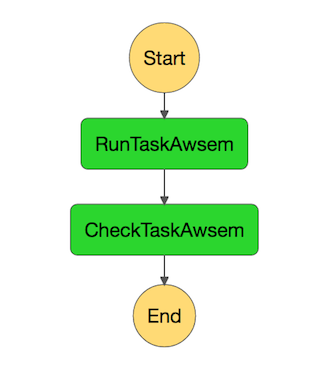

=================================
Tibanna Unicorn for General Users
=================================

Run a workflow
--------------

::

    invoke run_workflow --workflow=run_awsem_workflow_with_unicorns --input-json=<json_file_name>

The command should automatically open a step function run on a Web browser. If not, the url to the step function run is printed out to STDOUT and you can copy and paste it onto your browser to check the status of your run.

Input Json file
---------------

::

    {
      "config": {
        "ebs_size": 0,
        "ami_id": "ami-cfb14bb5",
        "json_bucket": "suwang",
        "EBS_optimized": "",
        "ebs_iops": 500,
        "shutdown_min": 30,
        "instance_type": "",
        "s3_access_arn": "arn:aws:iam::643366669028:instance-profile/s3_access_suwang",
        "ebs_type": "io1",
        "copy_to_s3": true,
        "script_url": "https://raw.githubusercontent.com/4dn-dcic/tibanna/master/awsf/",
        "launch_instance": true,
        "password": "whateverpasswordworks",
        "log_bucket": "suwang",
        "key_name": ""
      },
      "args": {
        "secondary_output_target": {},
        "app_name": "pairsam-parse-sort",
        "input_parameters": {
          "nThreads": 16
        },
        "cwl_child_filenames": [],
        "output_target": {
          "out_pairsam": "7b932aca-62f6-4d42-841b-0d7496567103/4DNFIPJMZ922.sam.pairs.gz"
        },
        "cwl_main_filename": "pairsam-parse-sort.cwl",
        "secondary_files": {},
        "output_S3_bucket": "suwang",
        "app_version": "0.2.0",
        "cwl_directory_url": "https://raw.githubusercontent.com/4dn-dcic/pipelines-cwl/0.2.0/cwl_awsem/",
        "input_files": {
          "bam": {
            "bucket_name": "suwang",
            "object_key": "5ae5edb2-8917-445a-b93f-46936a1478a8/4DNFI3F894Y3.bam"
          },
          "chromsize": {
            "bucket_name": "suwang",
            "object_key": "4a6d10ee-2edb-4402-a98f-0edb1d58f5e9/4DNFI823LSII.chrom.sizes"
          }
        }
      }
    }

Create an input json file similar to the above content, replace output ('output_target') and input file names and 'ebs_size'. The 'ebs_size' should be in GB and if it is set to 0, it will be auto-determined by the benchmark function. Likewise, 'instance_type' and 'EBS_optimized' can be set to be "", which allows the Benchmark function to auto-determine these parameters. One could override it by specifically assigning values to these fields (e.g. "EBS_optimized": true, "instance_type": "c2.xlarge", "ebs_size": 500). For a high IO performance, it is recommended to use "ebs_iops" to be higher (e.g. 20000), but 500 should be fine for regular jobs. More examples are in test_json/suwang*json.

Checking and Monitoring
-----------------------

Once the step function passes the first step ('RunTaskAsem'), you can check the 'input' of the 'CheckTaskAwsem' which contains a field called 'jobid'. This is your job ID and you can check your S3 bucket to see if you can find a file named <jobid>.log. This will happen 5~10min after you start the process, because it takes time for an instance to be ready and send the log file to S3. The log file gets updated, so you can re-download this file and check the progress.

::

    aws s3 cp s3://suwang/<jobid>.log .

You can also ssh into your running instance. The 'instance_ip' field in the 'input' of 'CheckTaskAwsem' contains the IP.

::

    ssh ec2-user@<ip>

The password is the password you entered as part of the input json (inside 'config' field, in this case, 'whateverpasswordworks') The purpose of the ssh is to monitor things, so refrain from doing various things there, which could interfere with the run. It is recommended, unless you're a developer, to use the log file than ssh.

You can also check from the Console the instance that is running which has a name awsem-<jobid>. It will terminate itself when the run finishes. You won't have access to terminate this or any other instance, but if something is hanging for too long, please contact the admin to resolve the issue.

When the run finishes successfully, you'll see in your bucket a file <jobid>.success. If there was an error, you will see a file <jobid>.error instead. The step functions will look green on every step, if the run was successful. If one of the steps is red, it means it failed at that step.

=========================  ======================
        Success                   Fail
=========================  ======================
|unicorn_stepfun_success|  |unicorn_stepfun_fail|
=========================  ======================

.. |unicorn_stepfun_success| image:: images/stepfunction_unicorn_screenshot_fail.png

